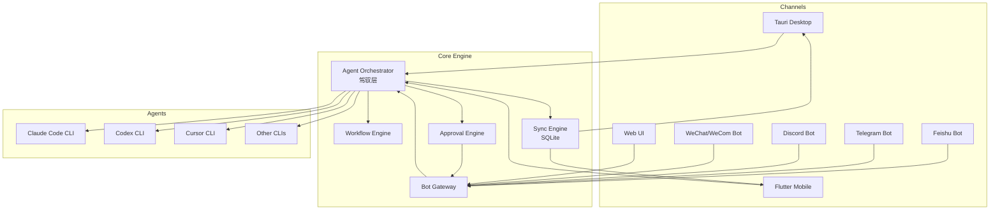
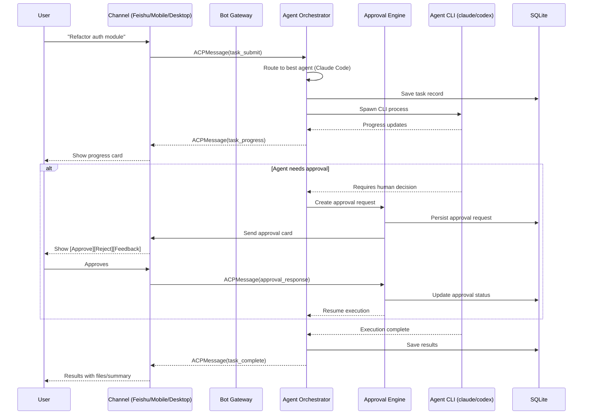

# ACP-UI Architecture Diagrams

## System Overview

```mermaid
graph TB
    subgraph Channels
        A[Tauri Desktop]
        B[Flutter Mobile]
        C[Feishu Bot]
        D[Telegram Bot]
        E[Discord Bot]
        F[WeChat/WeCom Bot]
        G[Web UI]
    end

    subgraph Core Engine
        H[Agent Orchestrator<br/>驾驭层]
        I[Workflow Engine]
        J[Approval Engine]
        K[Sync Engine<br/>SQLite]
        L[Bot Gateway]
    end

    subgraph Agents
        M[Claude Code CLI]
        N[Codex CLI]
        O[Cursor CLI]
        P[Other CLIs]
    end

    A --> H
    B --> H
    C --> L
    D --> L
    E --> L
    F --> L
    G --> L

    L --> H
    H --> I
    H --> J
    H --> K

    H --> M
    H --> N
    H --> O
    H --> P

    J --> L
    K --> A
    K --> B
```

## Data Flow

```mermaid
sequenceDiagram
    participant User
    participant Channel as Channel (Feishu/Mobile/Desktop)
    participant Gateway as Bot Gateway
    participant Orch as Agent Orchestrator
    participant Approval as Approval Engine
    participant Agent as Agent CLI (claude/codex)
    participant DB as SQLite

    User->>Channel: "Refactor auth module"
    Channel->>Orch: ACPMessage(task_submit)
    Orch->>Orch: Route to best agent (Claude Code)
    Orch->>DB: Save task record
    Orch->>Agent: Spawn CLI process
    Agent-->>Orch: Progress updates
    Orch-->>Channel: ACPMessage(task_progress)
    Channel-->>User: Show progress card

    alt Agent needs approval
        Agent-->>Orch: Requires human decision
        Orch->>Approval: Create approval request
        Approval->>DB: Persist approval request
        Approval->>Channel: Send approval card
        Channel-->>User: Show [Approve][Reject][Feedback]
        User->>Channel: Approves
        Channel->>Approval: ACPMessage(approval_response)
        Approval->>DB: Update approval status
        Approval-->>Orch: Resume execution
    end

    Agent-->>Orch: Execution complete
    Orch->>DB: Save results
    Orch-->>Channel: ACPMessage(task_complete)
    Channel-->>User: Results with files/summary
```
