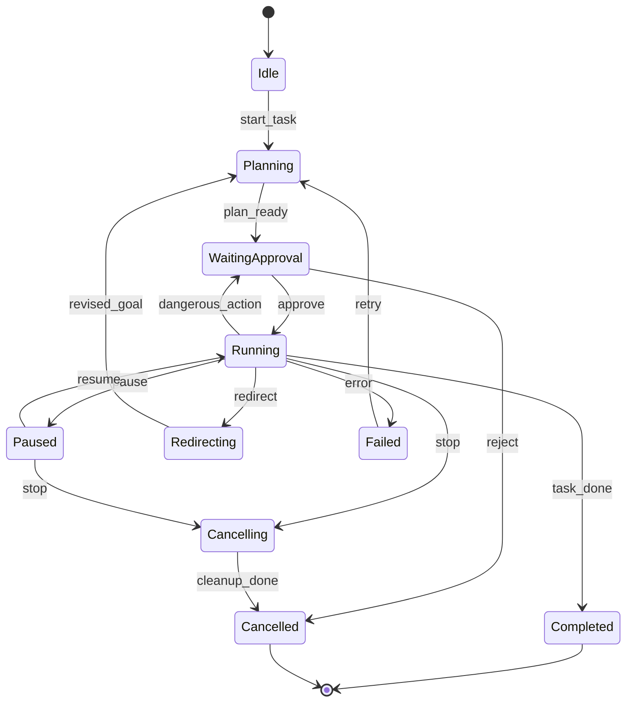

# 项目修整与 Agent 架构治理方案

> 日期：2026-07-08  
> 作者：Codex  
> 状态：执行前治理方案  
> 目标读者：项目负责人、Qwen3.7 Plus、Claude Code、后续执行 Agent  
> 关联文档：
> - `docs/codex/2026-07-08-hermes-game-operator-master-plan.md`
> - `docs/codex/2026-07-08-qwen-claude-execution-brief.md`

## 1. 结论

需要修整，而且必须认真修整。

这个项目现在不是“缺功能”，而是“方向很多、材料很多、边界不够硬”。如果继续堆功能，很容易出现下面几种危险结果：

- 前端页面越来越多，但没有一个真实闭环。
- 后端命令越来越多，但 Agent 不能稳定执行。
- Skill、MCP、Hook、Memory 都有名字，但没有统一协议。
- VSCode 插件、桌面端、未来 IDEA 插件各写一套逻辑，最后互相割裂。
- 进度面板显示得很好看，但不是从真实事件流来的。
- 记忆面板有内容，但不知道来源、作用范围和过期策略。
- 用户可以点“停止”，但底层任务其实没有真正停止。
- 用户可以点“审批”，但审批没有真正拦住危险操作。

所以第一优先级不是继续扩功能，而是把项目修整成一个可信 Agent 产品的骨架。

一句话：

```text
先把项目从“很多实验能力堆在一起”修整成“一个可控、可审计、可中断、可扩展的 Agent Operator 系统”。
```

## 2. 为什么 Agent 项目必须先治理

普通软件项目混乱，主要后果是开发慢、bug 多、维护累。

Agent 项目混乱，后果更严重，因为 Agent 会自动执行动作。它不是只展示信息，而是会读文件、改文件、运行命令、调用工具、写记忆、触发 Hook、连接外部服务。

Agent 产品最核心的不是“能不能生成内容”，而是这六件事：

1. 它知道自己正在做什么。
2. 用户知道它正在做什么。
3. 它什么时候能做、什么时候不能做有明确边界。
4. 用户能随时暂停、停止、接管和改方向。
5. 它留下的记录足够复盘。
6. 它的每一步都能被测试和验证。

如果项目不修整，这六件事都会变成空话。

## 3. 当前项目的真实状态判断

根据当前仓库结构，项目已经有很多很有价值的材料：

- Vue + Vite 前端主应用。
- Tauri 2 桌面壳。
- Rust 后端命令层。
- `src-tauri/hermes-crates` 下已有 Hermes Agent、Tool、Skill、Memory、Intelligence、Environment 等雏形。
- `src-tauri/crates` 下已有 event-bus、hook-runtime、tool-sandbox、workflow-engine、swarm-engine 等基础设施。
- `src/features` 下已有 games、agents、hermes、workflow、swarm、monitoring 等前端功能域。
- 已经有 VSCode 插件相关想法和局部能力。
- 已经有 Godot、Unity、Ren'Py 等 adapter/command 的痕迹。

这说明项目不是没基础。相反，基础材料很多。

问题在于：这些材料没有被收束成一个明确的主线产品。

现在更像是：

```text
ACP UI
  + Hermes Agent Framework
  + Swarm Engine
  + Workflow Engine
  + Game Tools
  + Enterprise/Finance remnants
  + Bot adapters
  + Mobile/Flutter experiments
  + SDK experiments
  + UI experiments
  + test/report artifacts
```

目标应该改成：

```text
Hermes Operator Platform
  + Game Operator MVP
    + Godot Domain Pack
    + Operator Control Plane
    + Agent Runtime Bridge
    + Tool/Approval/Memory/Event Protocol
  + Future Domain Packs
    + Unity
    + Ren'Py
    + Enterprise
    + Video
    + Comic
```

## 4. 现在最危险的混乱点

### 4.1 产品主线混乱

当前项目里有游戏开发、企业、财务、机器人适配、视频生成、漫画/内容创作、Flutter、SDK、工作流、Swarm 等方向。

这些方向不是错的，但不能同时成为第一阶段主线。

第一阶段主线只能是：

```text
Game Operator -> Godot MVP -> 单任务真实闭环
```

其他方向先进入 `experimental`、`archive` 或 `future domain pack`。

### 4.2 前端功能域太早扩张

当前 `src/features` 下已有多个方向：

```text
agent-teams
agents
chat
config
dashboard
games
hermes
intelligence
loop
monitoring
onboarding
plugins
swarm
tasks
workflow
```

这些名字都像主线，但真实用户第一眼只需要一个清楚入口：

```text
Game Operator
```

建议第一阶段前端只保留三个可见主导航：

```text
Game Operator
Agents
Settings
```

其他页面可以存在，但默认不作为主入口：

```text
Experiments
Diagnostics
Archive
```

### 4.3 后端命令层横向膨胀

`src-tauri/src/commands` 里已有：

```text
agent_config.rs
agent_lifecycle.rs
executive.rs
game_export.rs
game_launcher_cmds.rs
godot.rs
memory.rs
permission.rs
renpy.rs
self_evolution.rs
self_healing.rs
self_optimizing.rs
teams.rs
unity.rs
websocket_cmds.rs
...
```

问题不是这些文件存在，而是它们没有被一个统一的 Operator 协议收束。

未来所有命令都应该回答一个问题：

```text
这个命令属于 Operator Control Plane、Domain Pack、Integration、Diagnostics，还是 Legacy/Experimental？
```

如果回答不了，就不应该继续扩。

### 4.4 Adapter 数量很多，但产品闭环不清楚

`src-tauri/src/agent_adapter` 下已有：

```text
claude_adapter.rs
codex_adapter.rs
godot_adapter.rs
unity_adapter.rs
renpy_adapter.rs
flutter_adapter.rs
docker_adapter.rs
feishu_adapter.rs
wechat_adapter.rs
douyin_adapter.rs
kling_adapter.rs
kuaishou_adapter.rs
kubernetes_adapter.rs
wps_adapter.rs
...
```

这说明野心很大，但第一阶段不能让 adapter 数量决定产品路线。

正确顺序是：

```text
先定义 Agent Runtime Contract
再把 Godot Adapter 做成参考实现
最后复制到 Unity/Ren'Py/视频/企业
```

### 4.5 构建和测试基线不稳

已知状态：

- `npm run build` 存在 TypeScript 深度推断问题。
- Vitest 中混有不适合 Vitest 的游戏端测试。
- Tauri `invoke` 需要稳定 mock 或统一代理层。
- Rust 环境此前未能完整验证。
- `Cargo.lock` 不应在 Tauri app 中继续忽略。
- 仓库里同时出现 `package-lock.json` 和 `pnpm-lock.yaml`，需要确定包管理器策略。

Agent 项目没有稳定 build/test 基线，就不应该继续引入新自动执行能力。

### 4.6 安全边界不足

Agent 能执行工具，就必须先有权限边界。

至少需要明确：

- 哪些目录可读。
- 哪些目录可写。
- 哪些命令可运行。
- 哪些操作必须审批。
- 哪些操作永远禁止。
- 哪些外部网络调用允许。
- 记忆里哪些内容不能存。

如果安全边界后置，后续会很难补。

## 5. 修整目标

这次修整不是为了“看起来整洁”，而是为了让 Agent 能真实可靠地执行。

修整目标分为六个：

1. 主线明确：第一阶段只做 Godot Game Operator。
2. 结构清楚：前端、后端、Domain Pack、集成层边界明确。
3. 协议稳定：任务、事件、审批、记忆、工具调用都有统一 schema。
4. 控制真实：暂停、继续、停止、改方向不是 UI 假动作。
5. 安全可审计：危险操作必须被拦截、审批、记录。
6. 可持续扩展：以后加 VSCode、IDEA、Unity、视频、漫画时不用推倒重来。

## 6. 推荐目标架构

建议把项目抽象成五层。

```text
┌──────────────────────────────────────────────┐
│ Clients                                      │
│ Desktop UI / VSCode / Future IDEA / Mobile   │
└──────────────────────────────────────────────┘
                    │
                    ▼
┌──────────────────────────────────────────────┐
│ Operator Control Plane                       │
│ task state / approval / event / memory view   │
└──────────────────────────────────────────────┘
                    │
                    ▼
┌──────────────────────────────────────────────┐
│ Agent Runtime                                │
│ planning / execution / interruption / tools   │
└──────────────────────────────────────────────┘
                    │
                    ▼
┌──────────────────────────────────────────────┐
│ Domain Packs                                 │
│ Godot first, then Unity, Ren'Py, Video...     │
└──────────────────────────────────────────────┘
                    │
                    ▼
┌──────────────────────────────────────────────┐
│ Tooling and Environment                      │
│ file / shell / MCP / hooks / sandbox / memory │
└──────────────────────────────────────────────┘
```

这一层级非常重要。

VSCode 插件和 IDEA 插件不应该各自实现 Agent。它们只是 Client。

真正的 Agent 控制能力在 Operator Control Plane 和 Agent Runtime。

## 7. 目标目录结构

不要一上来大搬家。第一阶段建议采用“新主线目录 + 旧能力归类”的方式。

### 7.1 前端目标结构

建议逐步调整为：

```text
src/
  features/
    game-operator/
      views/
        GameOperatorView.vue
      components/
        OperatorControlBar.vue
        OperatorProgressTimeline.vue
        OperatorPlanPanel.vue
        OperatorMemoryPanel.vue
        OperatorDirectionPanel.vue
        OperatorApprovalDrawer.vue
        OperatorDiffViewer.vue
      composables/
        useOperatorTask.ts
        useOperatorEvents.ts
        useOperatorApproval.ts
      api/
        operatorApi.ts
        godotOperatorApi.ts
      types/
        operator.ts
        godot.ts

    agents/
      ...

    settings/
      ...

    experiments/
      workflow/
      swarm/
      intelligence/
      legacy-games/
```

第一阶段不要急着删除所有旧页面，可以先把导航隐藏或迁移到 `experiments`。

用户主入口必须简单：

```text
Game Operator -> Open Project -> Start Task
```

### 7.2 后端目标结构

Rust 后端建议逐步收束为：

```text
src-tauri/src/
  operator/
    mod.rs
    task.rs
    state_machine.rs
    events.rs
    approval.rs
    memory_view.rs
    commands.rs

  agent_runtime/
    mod.rs
    bridge.rs
    interruption.rs
    tool_call.rs
    execution_log.rs

  domains/
    games/
      mod.rs
      godot/
        mod.rs
        project_analyzer.rs
        scene_parser.rs
        script_analyzer.rs
        task_planner.rs
        file_patch.rs
        validation.rs

  integrations/
    vscode/
      mod.rs
    idea/
      mod.rs

  security/
    mod.rs
    permissions.rs
    approval_policy.rs
    path_guard.rs
    command_guard.rs

  observability/
    mod.rs
    event_store.rs
    timeline.rs
    diagnostics.rs
```

这不是要求马上把所有文件移动完。

第一阶段可以先新增 `operator` 和 `domains/games/godot`，然后让旧的 `commands/godot.rs` 调用新模块。这样风险小，也便于回滚。

### 7.3 Hermes crates 的定位

`src-tauri/hermes-crates` 不应该被当成 UI 项目的一堆工具文件。

它们应该被定位为 Agent Runtime 的能力库：

```text
hermes-agent        -> Agent loop, session, interruption
hermes-core         -> Core traits and types
hermes-config       -> Model/tool/session configuration
hermes-tools        -> Tool registry and tool dispatch
hermes-skills       -> Skill loading and routing
hermes-memory       -> Memory persistence and retrieval
hermes-intelligence -> routing, prompt, usage, model metadata
hermes-environments -> local/docker/remote environment
```

Operator 层不要直接到处调用这些 crate 的内部细节。

推荐只通过一个桥接模块访问：

```text
src-tauri/src/agent_runtime/bridge.rs
```

这个 bridge 负责把 OperatorTask 转成 Hermes Agent 可执行任务，再把 Hermes 的输出转成 OperatorEvent。

### 7.4 Domain Pack 的定位

Godot 不应该只是一个 adapter 文件。

它应该成为第一个 Domain Pack。

Godot Domain Pack 至少包含：

```text
domain-pack: godot
  project_analyzer
  task_templates
  skill_docs
  tool_descriptors
  hook_rules
  memory_schema
  validation_checks
  ui_extensions
  demo_project_contract
```

未来 Unity、Ren'Py、视频、漫画、企业办公都按这个模型扩展。

## 8. Operator 状态机

Agent 项目最怕“按钮有了，状态假的”。

第一阶段必须先定义状态机。



### 8.1 状态定义

```text
Idle
  没有任务运行。

Planning
  Agent 正在分析项目和生成计划。

WaitingApproval
  等待用户审批计划、diff 或危险工具调用。

Running
  Agent 正在执行已批准动作。

Paused
  用户暂停，Agent 必须停止发起新工具调用。

Redirecting
  用户修改方向，系统需要重新规划。

Cancelling
  用户要求停止，系统正在取消任务并清理资源。

Cancelled
  任务已停止，不能继续写文件或调用工具。

Failed
  任务失败，需要错误原因和恢复建议。

Completed
  任务完成，需要总结和产物列表。
```

### 8.2 暂停的真实语义

暂停不是前端隐藏 spinner。

暂停必须满足：

- 不再发起新的 LLM 请求。
- 不再发起新的工具调用。
- 已经开始的安全读操作可以完成。
- 已经开始的写操作必须进入可解释状态。
- 如果写操作不可中断，完成后必须停在 `Paused`，不能继续下一步。
- UI 必须显示“暂停前最后完成的事件”。

### 8.3 停止的真实语义

停止必须满足：

- 设置 cancellation token。
- 阻止后续工具调用。
- 终止可终止的子进程。
- 记录已完成和未完成步骤。
- 输出取消总结。
- 不允许从 `Cancelled` 直接恢复，只能新建任务。

### 8.4 改方向的真实语义

改方向不是把用户新输入追加到聊天里。

改方向应该生成一个 `RedirectRequest`：

```json
{
  "task_id": "task_123",
  "reason": "玩家希望二段跳改成冲刺",
  "new_goal": "把 Player 的二段跳改成空中冲刺",
  "preserve_completed_work": true,
  "requires_replan": true
}
```

Agent 收到后必须：

1. 总结当前已完成工作。
2. 判断哪些修改要保留。
3. 生成新计划。
4. 等待用户审批。

## 9. 事件协议

进度面板必须来自真实事件流。

不要让前端自己猜状态。

建议最小事件结构：

```json
{
  "event_id": "evt_001",
  "task_id": "task_123",
  "timestamp": "2026-07-08T09:30:00+08:00",
  "type": "tool_call_started",
  "level": "info",
  "title": "读取 Player.gd",
  "message": "Agent 正在读取玩家脚本以分析移动逻辑",
  "source": "agent_runtime",
  "payload": {
    "tool": "file.read",
    "path": "res://scripts/Player.gd"
  }
}
```

### 9.1 第一阶段事件类型

必须支持：

```text
task_created
task_started
project_analyzed
plan_started
plan_ready
approval_requested
approval_granted
approval_rejected
tool_call_started
tool_call_succeeded
tool_call_failed
file_read
file_patch_proposed
file_patch_applied
memory_read
memory_written
hook_started
hook_succeeded
hook_failed
task_paused
task_resumed
task_redirected
task_cancelling
task_cancelled
task_failed
task_completed
summary_ready
```

### 9.2 事件存储要求

第一阶段可以先用内存加本地文件，后续再进 SQLite。

但从第一天开始要按 append-only 设计：

```text
只追加事件，不原地改历史事件。
```

如果需要修正状态，追加一个新事件。

这样做的原因：

- 方便 UI 重放进度。
- 方便任务恢复。
- 方便调试 Agent 行为。
- 方便未来团队审计。

## 10. 审批模型

Agent 不能拥有最终控制权。

危险操作必须审批。

### 10.1 审批等级

建议分四级：

```text
Level 0: Silent
  安全读操作，不需要打扰用户。

Level 1: Notify
  可以执行，但需要在进度里展示。

Level 2: Approve
  执行前必须用户批准。

Level 3: Forbidden
  永远禁止，除非用户修改安全策略。
```

### 10.2 Godot MVP 审批矩阵

```text
读取 project.godot
  Level 0

读取 .gd/.tscn/.tres 文件
  Level 0

扫描项目目录
  Level 1

修改单个 .gd 文件
  Level 2

修改多个场景文件
  Level 2

运行 godot --headless 校验
  Level 2

删除文件
  Level 3

移动大量文件
  Level 3

访问项目外目录
  Level 3

执行任意 shell 命令
  Level 3，除非命令在 allowlist

访问网络
  Level 2 或 Level 3，取决于目标
```

### 10.3 审批请求结构

```json
{
  "approval_id": "appr_001",
  "task_id": "task_123",
  "level": "approve",
  "action": "file.patch",
  "title": "修改 Player.gd 以增加二段跳",
  "reason": "任务目标要求增加二段跳逻辑",
  "risk": "可能影响玩家跳跃手感",
  "preview": {
    "files": ["res://scripts/Player.gd"],
    "diff_id": "diff_001"
  },
  "options": ["approve", "reject", "request_changes"]
}
```

审批被拒绝时，Agent 必须进入重新规划，而不是继续执行。

## 11. 记忆模型

记忆不是“把聊天记录存起来”。

Agent 的记忆必须分层。

### 11.1 三层记忆

```text
Project Memory
  项目长期事实。
  例如：这是 Godot 4 项目，主角脚本是 Player.gd，输入映射使用 jump/action_dash。

Task Memory
  当前任务上下文。
  例如：本次任务目标是增加二段跳，用户要求保持原手感。

Operator Memory
  用户偏好和工作方式。
  例如：用户喜欢先看 diff，不喜欢 Agent 自动运行长命令。
```

### 11.2 Godot Domain Memory

Godot 领域记忆可以记录：

```text
engine_version
main_scene
autoloads
input_map
script_language
important_nodes
player_controller_path
physics_process_patterns
test_scene_path
export_presets
```

### 11.3 记忆写入规则

只有满足下面条件才写记忆：

- 对未来任务有用。
- 来源可追溯。
- 不包含密钥。
- 不包含用户隐私。
- 不只是临时推理。
- 用户可以在面板中看到或删除。

### 11.4 记忆结构

```json
{
  "memory_id": "mem_001",
  "scope": "project",
  "domain": "godot",
  "key": "player_controller_path",
  "value": "res://scripts/Player.gd",
  "source_event_id": "evt_020",
  "confidence": 0.91,
  "created_at": "2026-07-08T09:45:00+08:00",
  "expires_at": null
}
```

记忆面板至少要显示：

- 记忆内容。
- 来源。
- 置信度。
- 最近使用时间。
- 删除按钮。

## 12. Tool/MCP/Skill/Hook 的关系

这四个概念必须拆清楚。

### 12.1 Tool

Tool 是 Agent 可执行的原子能力。

例如：

```text
file.read
file.patch
godot.analyze_project
godot.run_headless_check
memory.search
memory.write
```

Tool 必须有 schema、权限等级、输入输出和错误模型。

### 12.2 MCP

MCP 是外部工具接入协议。

它不等于业务能力本身。

第一阶段可以先做本地内置工具，不要为了 MCP 形式而把 Godot MVP 复杂化。

正确路线：

```text
先定义内部 Tool Contract
再让 MCP server 适配这个 Contract
```

### 12.3 Skill

Skill 是指导 Agent 如何使用工具完成某类任务的知识包。

Godot Skill 示例：

```text
godot-project-analysis
godot-player-controller-editing
godot-scene-safe-patching
godot-input-map-management
godot-headless-validation
```

Skill 不应该只是提示词。

一个合格 Skill 至少包含：

- 适用场景。
- 禁止事项。
- 输入文件。
- 推荐工具。
- 操作流程。
- 验收方式。
- 常见失败恢复。

### 12.4 Hook

Hook 是执行前后自动触发的规则。

Godot MVP 可先支持：

```text
before_file_patch
after_file_patch
before_shell_command
after_task_complete
on_task_failed
```

Hook 不能偷偷做危险操作。

Hook 自己也要走权限系统。

## 13. Agent 角色设计

第一阶段不建议一口气做很多 Agent。

建议只有一个主执行 Agent，加少量内置角色逻辑：

```text
Game Operator Agent
  - 分析项目
  - 制定计划
  - 请求审批
  - 调用工具
  - 解释进度
  - 处理暂停/停止/改方向
```

等 Godot MVP 稳定后，再拆成多个子 Agent。

### 13.1 未来可拆的 Agent

```text
godot-project-analyst
  专门分析 Godot 项目结构。

godot-code-implementer
  专门修改 GDScript 和场景相关文件。

operator-safety-reviewer
  专门判断工具调用风险和审批等级。

operator-test-runner
  专门运行验证命令并解释失败。

gameplay-ux-reviewer
  专门评估玩法改动是否符合手感目标。
```

### 13.2 Claude Code 风格 Agent 文件要求

如果后续要做 Claude Code plugin agent，文件必须包含：

- 清晰 `name`。
- 带示例的 `description`。
- `model`。
- `color`。
- 最小化 `tools`。
- 系统提示词。
- 触发条件。
- 输出格式。

不要写泛泛的 `helper`、`assistant`、`game-agent`。

推荐命名：

```text
godot-project-analyst
godot-task-planner
godot-script-implementer
operator-safety-reviewer
operator-progress-reporter
```

但注意：这些是未来拆分。第一阶段先把一个主 Agent 闭环跑通。

## 14. 第一阶段要冻结的事情

在 Godot MVP 闭环之前，建议冻结：

- Unity 新功能。
- Ren'Py 新功能。
- Unreal 新功能。
- 视频生成工作流。
- 漫画创作工作流。
- 企业/财务/运营新功能。
- 新移动端功能。
- IDEA 插件实现。
- 多 Agent Swarm 复杂编排。
- 自我进化/self-evolution 类功能。

可以保留代码，但不要扩。

冻结不是放弃，而是避免主线死亡。

## 15. 修整阶段计划

### Phase A：基线恢复

目标：项目能稳定构建、测试、运行。

任务：

1. 修复 `npm run build`。
2. 明确 TypeScript/Vue 类型错误来源。
3. 把 Vitest、Playwright、WebdriverIO 分层。
4. 解决 Tauri invoke mock 问题。
5. 确认 Rust 环境可用。
6. 运行或记录 `cargo check` 状态。
7. 决定 npm 或 pnpm，第一阶段建议沿用 npm，因为已有 `package-lock.json` 和 npm scripts。
8. 将 `Cargo.lock` 纳入版本管理。
9. 清理或 ignore 测试产物目录。

验收：

```text
npm run build
npm run test
```

Rust 验收：

```text
cargo check
```

如果本机没有 Rust 工具链，要在文档中记录为阻塞项，不要假装通过。

### Phase B：产品入口收束

目标：用户打开应用时知道该干什么。

任务：

1. 主导航收束到 `Game Operator`、`Agents`、`Settings`。
2. 把实验页面移动到隐藏入口或 `Experiments`。
3. 删除或隐藏旧假 AI 游戏页面。
4. 明确 `/games` 路由只服务新 Game Operator。
5. 移除旧 `/games/designer` 类测试或转到 e2e。

验收：

```text
应用主入口只突出 Godot Game Operator。
旧 mock 页面不会被用户误认为真实功能。
```

### Phase C：协议先行

目标：先定合同，再写功能。

必须定义：

```text
OperatorTask
OperatorEvent
ApprovalRequest
ToolCall
ToolResult
MemoryRecord
DomainPackManifest
AgentRunConfig
```

这些类型前后端都要使用。

建议 TypeScript 和 Rust 各自有类型定义，但字段命名保持一致。

### Phase D：Operator Control Plane

目标：实现真实控制。

任务：

1. 建立任务状态机。
2. 建立事件存储。
3. 建立审批队列。
4. 建立暂停/继续/停止控制。
5. 建立任务总结。
6. 前端通过事件流渲染进度。

验收：

```text
用户点暂停后，Agent 不再发起新工具调用。
用户点停止后，任务进入 Cancelled 并输出取消总结。
审批拒绝后，Agent 不会继续执行被拒操作。
```

### Phase E：Godot Domain Pack

目标：第一个真实业务闭环。

任务：

1. 识别 `project.godot`。
2. 读取项目基础信息。
3. 扫描 scenes/scripts/assets。
4. 找到玩家控制器候选。
5. 生成任务计划。
6. 提出 diff。
7. 用户审批后应用 patch。
8. 可选运行 Godot headless 校验。
9. 输出总结。

验收 Demo：

```text
在一个真实 Godot 项目里，让 Agent 给 Player 增加二段跳。
```

### Phase F：VSCode 插件连接

目标：证明 IDE 插件只是客户端。

任务：

1. VSCode 插件连接本地 Operator Core。
2. 显示当前任务状态。
3. 显示进度事件。
4. 提供暂停/继续/停止。
5. 打开 diff。
6. 不在插件里重新实现 Agent。

验收：

```text
桌面端和 VSCode 看到同一个 task_id 的同一条事件流。
```

### Phase G：扩展到其他领域

只有 Godot MVP 稳定后才进入。

扩展顺序建议：

```text
Unity
Ren'Py
IDEA
Video
Comic
Enterprise
Operations
```

每个新领域都必须作为 Domain Pack 接入，而不是复制一套系统。

## 16. 具体文件级修整建议

### 16.1 先不移动的内容

这些目录暂时不要大移动：

```text
src-tauri/hermes-crates
src-tauri/crates
sdk
acp_ui_flutter
```

原因：移动会引发大量路径、Cargo workspace、测试和构建问题。

第一阶段先通过文档和入口限制它们的职责。

### 16.2 可以优先新建的内容

```text
src/features/game-operator/
src-tauri/src/operator/
src-tauri/src/domains/games/godot/
docs/codex/
```

### 16.3 需要清理或归档的内容

```text
dist/
test-output/
test-results/
playwright-report/
playwright-report-functional/
junit-results/
*.png 调试截图
```

如果这些是生成产物，应确认 `.gitignore`。

注意：不要直接删除用户可能需要的文件。先确认是否已入 git、是否是当前调试产物。

### 16.4 Lock 文件策略

第一阶段建议：

```text
Node 包管理器：npm
保留：package-lock.json
移除或暂不提交：pnpm-lock.yaml
Rust：提交 Cargo.lock
```

如果后续决定切 pnpm，再单独做一个迁移提交。

不要长期同时维护两个 Node lock 文件。

## 17. API 和命令设计

Tauri 命令不要碎片化成一堆页面专用函数。

第一阶段建议命令：

```text
operator_start_task
operator_pause_task
operator_resume_task
operator_stop_task
operator_redirect_task
operator_get_task
operator_list_events
operator_approve
operator_reject
operator_get_memory
operator_delete_memory
godot_analyze_project
```

其中 Godot 相关命令尽量只暴露少数入口，具体执行藏在 Domain Pack 内。

### 17.1 operator_start_task 输入

```json
{
  "domain": "game.godot",
  "project_path": "D:/projects/my-godot-game",
  "goal": "给 Player 增加二段跳",
  "mode": "propose_then_apply",
  "approval_policy": "safe_default"
}
```

### 17.2 operator_start_task 输出

```json
{
  "task_id": "task_123",
  "status": "planning",
  "event_stream": "operator://tasks/task_123/events"
}
```

### 17.3 operator_approve 输入

```json
{
  "task_id": "task_123",
  "approval_id": "appr_001",
  "decision": "approve"
}
```

### 17.4 operator_redirect_task 输入

```json
{
  "task_id": "task_123",
  "new_goal": "不要二段跳了，改成空中冲刺",
  "preserve_completed_work": true
}
```

## 18. 前端 UI 细化

Game Operator 页面第一版建议分为五区。

```text
顶部：项目与任务状态
左侧：任务计划与步骤
中间：进度事件流
右侧：记忆与方向
底部/抽屉：审批与 diff
```

### 18.1 顶部状态

显示：

- 当前项目名。
- 引擎：Godot。
- 当前状态。
- 当前 Agent。
- 最近事件时间。
- 风险等级。

控制按钮：

- Pause。
- Resume。
- Stop。
- Redirect。
- Open Diff。
- Approve。
- Reject。

### 18.2 进度事件流

每条事件至少显示：

- 时间。
- 标题。
- 类型。
- 来源。
- 展开后的 payload。

不要只显示“正在思考”。

### 18.3 计划面板

计划步骤要可勾选：

```text
[done] 分析项目结构
[done] 找到 Player.gd
[running] 生成二段跳 patch
[waiting] 等待用户审批
[pending] 应用 patch
[pending] 运行校验
```

### 18.4 记忆面板

显示：

```text
Project Memory
Task Memory
Operator Memory
```

用户可以删除或禁用某条记忆。

### 18.5 最终走向面板

这个面板不是摘要，而是“如果继续执行，Agent 将把项目带向哪里”。

示例：

```text
当前方向：
增加二段跳，不改变地面移动手感。

即将修改：
res://scripts/Player.gd

不会修改：
场景结构、输入映射、敌人逻辑。

下一次需要你审批：
应用 Player.gd patch。
```

## 19. 测试策略

### 19.1 单元测试

覆盖：

- 状态机转移。
- 审批等级判断。
- 事件 append-only。
- 记忆写入规则。
- Godot 项目识别。
- path guard。

### 19.2 集成测试

覆盖：

- start_task -> plan_ready。
- approval_granted -> file_patch_applied。
- pause 后不再产生 tool_call_started。
- stop 后进入 cancelled。
- redirect 后重新生成计划。

### 19.3 E2E 测试

只覆盖关键路径：

```text
打开 Game Operator
选择测试 Godot 项目
输入任务
看到计划
审批
看到 diff
完成总结
```

不要把 WebdriverIO 测试混进 Vitest。

## 20. 安全治理

### 20.1 路径安全

Agent 只能在用户选择的项目目录内写文件。

任何项目外写入都必须禁止。

路径判断必须使用规范化后的绝对路径，不要用字符串前缀简单判断。

### 20.2 命令安全

第一阶段命令 allowlist：

```text
godot --version
godot --headless --path <project> --check-only
```

具体命令以后根据 Godot 实际支持能力调整。

不要允许任意 shell。

### 20.3 Secret 安全

禁止写入记忆：

- API key。
- token。
- cookie。
- 私钥。
- 用户个人身份信息。
- 商业敏感文档内容。

### 20.4 审计

每次写文件都记录：

- 谁发起。
- 为什么发起。
- 审批 ID。
- diff ID。
- 文件路径。
- 成功或失败。

## 21. 给 Qwen3.7 Plus 的详细任务

Qwen 不应该直接改代码为主。

Qwen 更适合做：

1. 把本文档拆成 Epic/Story。
2. 为每个 Story 写输入、输出、验收标准。
3. 设计 Godot MVP 的用户流程。
4. 写 Godot Skill 文档草案。
5. 写审批矩阵细化表。
6. 写测试用例表。
7. 对 Claude Code 产出的实现做产品一致性检查。

第一条提示词建议：

```text
请阅读 docs/codex 下三份文档，以 docs/codex/2026-07-08-project-restructure-and-agent-governance.md 为工程治理依据。

任务：
1. 只围绕 Godot Game Operator MVP 拆解 Epic/Story。
2. 先拆 Phase A 到 Phase E，不要扩展 Unity、视频、漫画、企业。
3. 每个 Story 必须包含：目标、涉及文件、输入、输出、验收命令、风险、是否需要用户审批。
4. 单独输出一份 Claude Code 执行顺序。
5. 标出哪些 Story 必须先完成才能开始 Agent 功能。
```

## 22. 给 Claude Code 的详细任务

Claude Code 应该按工程顺序执行。

不要一开始就做漂亮 UI。

执行顺序：

1. 修 build。
2. 修 test 分层。
3. 清理假 AI 残留。
4. 固定 lock 策略。
5. 建 Operator types。
6. 建后端状态机。
7. 建事件流。
8. 建审批模型。
9. 建 Godot analyzer。
10. 接前端 Game Operator。
11. 做真实 demo。

第一条提示词建议：

```text
请阅读 docs/codex 下三份文档。

先执行 Phase A：基线恢复。

要求：
1. 不新增新功能。
2. 修复 npm run build。
3. 梳理 Vitest/Playwright/WebdriverIO 测试边界。
4. 处理 Tauri invoke mock 问题。
5. 检查 Cargo.lock 和 package lock 策略。
6. 输出清楚的变更摘要和验证命令。

完成 Phase A 前，不要开始 Godot Operator UI。
```

## 23. 提交拆分建议

### Commit 1：docs/codex planning

内容：

- 总纲规划。
- 修整与治理方案。
- Qwen/Claude 执行交接。

### Commit 2：baseline build and test cleanup

内容：

- 修 `npm run build`。
- 修 Vitest 分层。
- 修 Tauri invoke mock。
- 调整 lock 文件策略。

### Commit 3：remove legacy fake game AI

内容：

- 删除旧假 AI 游戏页面。
- 删除旧测试。
- 隐藏旧路由。

### Commit 4：operator protocol

内容：

- OperatorTask。
- OperatorEvent。
- ApprovalRequest。
- MemoryRecord。
- ToolCall/ToolResult。

### Commit 5：operator state machine

内容：

- Rust 状态机。
- 事件 append-only。
- pause/resume/stop。
- 单元测试。

### Commit 6：godot domain pack MVP

内容：

- Godot 项目分析。
- Godot task plan。
- file patch proposal。
- approval before apply。

### Commit 7：game operator UI

内容：

- 控制条。
- 进度流。
- 计划面板。
- 记忆面板。
- 审批抽屉。

### Commit 8：vscode connector

内容：

- VSCode 连接本地 Operator Core。
- 共享 task/event。

## 24. 判断修整是否成功

修整成功不是目录看起来漂亮。

修整成功的标准是：

```text
一个新执行 Agent 读完 docs/codex 后，能明确知道：
1. 第一阶段只做 Godot。
2. 哪些旧功能不能继续扩。
3. 如何修 build/test。
4. Operator 状态机是什么。
5. 事件从哪里来。
6. 审批怎么拦住危险动作。
7. 记忆怎么写、怎么删、怎么展示。
8. VSCode/IDEA 为什么只是客户端。
9. Godot Domain Pack 需要哪些能力。
10. 每一步如何验收。
```

如果做到这些，这个项目就从“混乱大仓库”变成“可执行的 Agent 产品工程”。

## 25. 最重要的执行原则

后续所有执行模型都必须遵守：

1. 先基线，后功能。
2. 先协议，后页面。
3. 先 Godot，后多引擎。
4. 先单 Agent 闭环，后多 Agent Swarm。
5. 先本地可信执行，后远程/移动审批。
6. 先真实事件流，后漂亮进度面板。
7. 先安全边界，后工具扩展。
8. 先可验证 demo，后宏大平台。

最后一句：

```text
Hermes Game Operator 的核心不是“让 AI 看起来很忙”，而是让用户放心地把一部分游戏开发工作交给一个可控、可停、可审、可复盘的 Agent。
```

