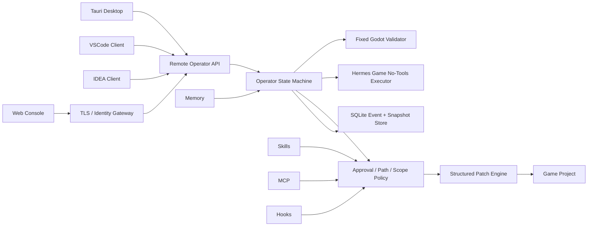
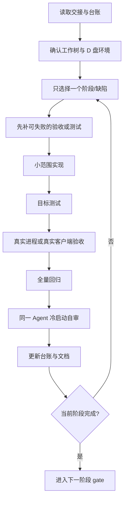

# 游戏开发 Agent 当前交接与后续执行总计划

> 状态：当前最高优先级执行依据  
> 交接时间：2026-07-10  
> 工作目录：`D:\dingsun\acp-ui`  
> 当前分支：`cleanup/project-snapshot-2026-06-25`  
> 当前 HEAD：`df8bcbc`  
> 适用对象：项目负责人、使用 Qwen 3.7 Plus 模型的 Claude Code、后续实现与验收 Agent

> 文档定位更新：本文件保留当前代码、测试、桌面证据、阻塞和 D 盘命令，是“当前状态交接”，不是最终产品规划。完整产品必须同时具备的能力，以 `docs/codex/2026-07-10-hermes-game-operator-complete-product-blueprint.md` 为准。本文件中的阶段划分只记录历史执行思路，不得用来缩小完整产品完成定义。

## 一、先说结论

产品方向是正确的，但当前不能宣称“游戏开发 Agent 已经完成”。

正确的产品主线是：

```text
Operator 控制面
  -> 创建真实游戏开发任务
  -> Agent 生成计划
  -> 操作员审批计划
  -> 无写权执行器生成结构化候选补丁
  -> Operator 校验路径、哈希、diff 和风险
  -> 操作员审批具体文件改动
  -> Operator 备份、应用、验证、回滚和记录
  -> 操作员可暂停、恢复、停止或改变方向
  -> 桌面、VSCode、IDEA、Web 共享同一任务状态
```

这条主线已经有可信后端骨架，当前要做的是把它收口成可重复验收的产品，而不是继续横向堆 ERP、视频、漫画、运营、Unity、Unreal 等新领域。

最重要的架构判断保持不变：

1. ACP Operator 是唯一控制面和最终写入者。
2. Hermes Game 是受限执行器，不持有项目写权限。
3. 计划审批与文件补丁审批是两次不同授权，不能合并。
4. 模型输出始终是不可信数据，只能经过确定性解析与策略校验。
5. 桌面、VSCode、IDEA 和 Web 都只能是同一 Remote Operator API 的客户端，不能各自复制 Agent runtime 或状态机。
6. Skills、MCP、Hooks 和 Memory 必须服从 Operator policy，不能绕过审批直接写项目。

## 二、文档优先级

后续执行者按以下顺序阅读：

1. 本文档。
2. `docs/codex/2026-07-10-qwen-claude-execution-prompts.md`。
3. `docs/codex/2026-07-10-execution-ledger-template.md`。
4. `docs/codex/2026-07-10-game-agent-closure-and-roadmap.md`。
5. `docs/codex/2026-07-10-operator-persistence-and-recovery-spec.md`。
6. `_bmad-output/implementation-artifacts/spec-hermes-structured-patch-approval.md`。
7. `_bmad-output/implementation-artifacts/spec-secure-remote-operator-access.md`。

若旧文档与本文档对“当前状态”的描述冲突，以本文档为准。旧文档仍用于理解设计历史，不应被删除。

## 三、当前可信状态

### 3.1 状态总表

| 能力 | 当前事实 | 状态 |
|---|---|---|
| Godot 项目分析与计划 | 已有真实后端链路和计划审批 | 已验收 |
| Hermes 无工具提案 | `--no-tools`、`--prompt-file`、严格 JSON 已真实在线验证 | 已验收 |
| 结构化补丁 | 路径、扩展名、哈希、大小、数量、symlink、stale 检查已实现 | 已验收 |
| 文件落盘 | 两级审批、备份、批量应用、写后校验、失败回滚已实现 | 已验收 |
| Godot 验证门 | 固定命令模板、超时、取消、输出截断、真实 Godot 4.7 smoke 已通过 | 已验收 |
| Operator 持久化 | SQLite schema v1、append-only events、审批与 pending 状态恢复已实现 | 已验收 |
| 远程控制 | 本机/受控局域网 HTTP API、Token 与 allowlist 基础层已实现 | 基础可用 |
| 真实 Tauri 窗口 | 已真实启动、创建远程任务、显示任务、重启恢复、修复部分布局 | 进行中 |
| 审批按钮窄窗可达性 | 1024x720 下审批卡可见，但底部决策按钮仍未形成可靠视觉证据 | 阻塞 P0-3 |
| 自动化桌面驱动 | 官方 tauri-driver 在当前机器上安装后被系统移除，尚无稳定 WebDriver | 工具阻塞 |
| VSCode 客户端 | 仓库中未发现实际扩展源码，只有 `.vscode` 工作区配置 | 未开始 |
| IDEA 客户端 | 仓库中未发现 IntelliJ Platform 插件源码 | 未开始 |
| Web 独立控制台 | 有 Remote API 客户端基座，无完整连接配置与企业安全层 | 未完成 |
| Skills/MCP/Hooks Game Pack | 基础设施分散存在，没有形成可审计的游戏领域包 | 未完成 |
| 企业身份与公网远程 | OIDC、RBAC、TLS 部署、持久审计、限流、密钥轮换未闭环 | 未完成 |

### 3.2 已完成且不要重复实现的后端能力

以下能力应优先复用，不要另起一套：

- `src-tauri/src/operator/structured_patch.rs`
  - 严格 serde schema。
  - create/replace 白名单。
  - 项目相对路径与保护目录校验。
  - Windows 保留名、大小写冲突和 symlink 防护。
  - SHA-256、逐文件 diff、preflight、备份、写入、回滚。
- `src-tauri/src/operator/hermes_game_bridge.rs`
  - 受限 Godot 文本上下文采集。
  - Hermes 0.4.0 能力探测。
  - `--no-tools` 与 `--prompt-file` 调用合同。
- `src-tauri/src/operator/godot_validation.rs`
  - ACP 固定参数模板。
  - D 盘 Godot 发现。
  - 超时、取消、输出上限与子进程回收。
- `src-tauri/src/operator/persistence.rs`
  - SQLite schema v1。
  - 任务、事件、审批、文件变更、pending patch、pending validation 快照。
  - 启动恢复与 stale 收口。
- `src-tauri/src/operator/commands.rs`
  - 创建、暂停、恢复、停止、重定向与审批语义。
- `src-tauri/src/http_server.rs`
  - Remote Operator 路由、安全策略和审计。
- `src/api/operatorRemoteApi.ts`
  - 当前 Remote HTTP TypeScript 客户端。

注意：`sdk/typescript/src/index.ts` 是旧 Worker SDK，主要调用 Tauri `invoke`，它不是 VSCode/IDEA 应复用的 Remote Operator SDK。后续应从 `src/api/operatorRemoteApi.ts` 抽出无 Vue、无 Tauri 依赖的共享客户端包。

## 四、真实桌面验收交接

### 4.1 本轮真实环境

所有本轮产物均位于 D 盘：

```text
D:\dingsun\acp-ui\.artifacts\desktop-acceptance\2026-07-10-codex
```

主要隔离路径：

```text
Godot fixture:
D:\dingsun\acp-ui\.artifacts\desktop-acceptance\2026-07-10-codex\project-1783658820041

Operator SQLite:
D:\dingsun\acp-ui\.artifacts\desktop-acceptance\2026-07-10-codex\operator\operator-state.sqlite3

WebView2 data:
D:\dingsun\acp-ui\.artifacts\desktop-acceptance\2026-07-10-codex\webview2-direct

ACP config:
D:\dingsun\acp-ui\.artifacts\desktop-acceptance\2026-07-10-codex\config\agents.json

History DB:
D:\dingsun\acp-ui\.artifacts\desktop-acceptance\2026-07-10-codex\history\history.db
```

真实任务：

```text
task_id: task_1783659056917
goal: Add a deterministic dash ability to the player controller
status: waiting_approval
approval action: operator.plan.generate_patch
approval options: approve, reject, request_changes
```

### 4.2 已证明的真实桌面事实

以下不是浏览器 mock：

1. `src-tauri/target/debug/acp-ui.exe` 已真实启动。
2. 真实窗口标题为 `ACP UI`。
3. 真实进程监听 `127.0.0.1:1422` 和 WebSocket `1421`。
4. 通过 Remote HTTP 创建的任务被真实 Tauri 窗口发现。
5. 真实桌面进程关闭并重启后，从同一 SQLite 恢复出同一个 task ID、事件和计划审批。
6. 重启时没有自动越过审批，也没有自动继续 Hermes/Godot。
7. 1024x720 下任务目标和 `Stop` 按钮已经可见。

关键截图：

| 截图 | 能证明什么 |
|---|---|
| `remote-task-discovered.png` | Remote 创建任务后，桌面 UI 自动发现并显示真实任务 |
| `operator-layout-fixed-1200x800.png` | 会话筛选不再溢出，Operator 切换到单栏 |
| `operator-restarted-restored-1024x720.png` | 真实桌面进程重启后恢复 task 与 waiting_approval |
| `operator-control-compact-1024x720.png` | 长目标完整显示，Stop 按钮可达 |
| `operator-bottom-approval-1024x720.png` | Redirect 与计划审批卡可见 |
| `operator-keyboard-navigation-1024x720.png` | 键盘焦点可进入 Redirect，但后续审批按钮滚动仍有问题 |
| `operator-unified-scroll-end-1024x720.png` | 最新尝试后仍未形成审批决策按钮可见证据 |

截图目录：

```text
D:\dingsun\acp-ui\.artifacts\desktop-acceptance\2026-07-10-codex\screenshots
```

### 4.3 本轮已经修复的桌面问题

1. D 盘隔离 profile 启动失败：
   - `src-tauri/src/config.rs` 新增 `ACP_UI_CONFIG_PATH`。
   - `src-tauri/src/database.rs` 新增 `ACP_UI_HISTORY_DB`。
   - `src-tauri/src/operator/hermes_process.rs` 增加 D 盘绝对路径 override 校验。
2. Remote 创建任务后桌面不更新：
   - `GameOperatorView.vue` 现在持续发现活动任务。
   - terminal/no-task 状态不再停止任务发现。
3. 主内容 flex 子项撑破窗口：
   - `src/App.vue` 的主区域增加 `min-width: 0`。
4. 侧栏搜索与 Agent 选择器裁切：
   - `SessionList.vue` 改为稳定网格布局。
5. Operator 三栏按整窗宽度误判：
   - `GameOperatorView.vue` 改用容器查询。
6. 控制条长目标与 Stop 按钮不可见：
   - `OperatorControlBar.vue` 增加换行和窄容器布局。

### 4.4 当前未解决的桌面问题

最高优先级缺陷：

```text
在 1024x720 窗口中，外层 Operator 可以滚到 Redirect 和审批卡，
但审批卡底部的 Approve / Reject / Request changes 尚未得到可靠可见证据。
滚轮与 Tab 能到达部分隐藏焦点，但没有把决策按钮稳定滚入视口。
```

当前工作树包含一组尚未完成全量回归的滚动修复：

- `ApprovalDrawer.vue` 尝试取消内部纵向滚动。
- `ProgressTimeline.vue` 尝试取消内部纵向滚动。
- `PlanPanel.vue` 尝试让外层 Operator 成为唯一滚动宿主。
- `GameOperatorView.vue` 包含容器查询和统一滚动相关样式。

这些改动不能直接算作修复完成。下一位执行者必须：

1. 检查真实 DOM 的 `clientHeight`、`scrollHeight`、`overflowY` 和焦点顺序。
2. 明确唯一纵向滚动宿主，不保留互相争抢滚轮的嵌套容器。
3. 在 1024x720 下显示三种审批按钮。
4. 使用键盘 Tab 聚焦每个按钮时自动滚入视图。
5. 在 1280x800 与 1440x900 下确认没有因此产生超长空白或面板高度异常。
6. 跑 ApprovalDrawer、ProgressTimeline、OperatorControlBar、GameOperatorView 和全量前端测试。

### 4.5 桌面自动化工具阻塞

已下载 EdgeDriver：

```text
D:\dingsun\acp-ui\.artifacts\desktop-acceptance\2026-07-10-codex\drivers\msedge-150\msedgedriver.exe
version: 150.0.4078.65
```

尝试安装官方 `tauri-driver 2.0.6` 时，Cargo 报告成功，但未签名二进制在首次执行前后从 D 盘消失。没有找到可审计的 Defender 事件，重复安装没有产生新信息。

后续不要无限重复安装。按以下顺序处理：

1. 在受控 Windows 构建机生成并签名 `tauri-driver`。
2. 或由用户明确配置 Defender 允许规则后复验。
3. 或验证 `@wdio/tauri-service` 能否直接使用现有 EdgeDriver 与 WebView2。
4. 工具仍不可用时，保留真实窗口、真实 Win32 输入、PrintWindow 截图和后端状态证据，但不能把它冒充成可维护的 desktop E2E。

### 4.6 当前进程状态

交接文档编写前已关闭：

- Vite dev server。
- `acp-ui.exe`。
- `1420`、`1421`、`1422` 相关监听。

下一位执行者需要自己显式启动，不要假设已有后台进程。

## 五、工作树安全规则

当前工作树非常脏，包含大量早于本轮存在的修改、生成目录和历史实验。不得执行：

```text
git reset --hard
git checkout -- .
git clean -fdx
cargo fix --workspace
全仓换行符或格式化重写
```

第一轮必须生成变更归属清单：

| 类别 | 处理方式 |
|---|---|
| 本轮 Game Operator 相关改动 | 继续验证与修复 |
| 既有用户改动 | 保留，不回退 |
| 临时验收产物 | 保留在 `.artifacts`，不要提交 |
| `.operator`、`.tmp-tests` | 测试数据，不提交 |
| 大量 examples/adapter 改动 | 在来源不明前不修改 |
| 未跟踪实现文件 | 先审计引用与测试，再决定提交边界 |

建议先产生：

```text
docs/codex/worktree-inventory-<date>.md
```

清单至少包含：路径、来源推断、是否进入 Game Agent 主线、是否有测试、是否应提交、是否应忽略。

## 六、D 盘执行环境

### 6.1 固定工具路径

```text
Node:
D:\WpSystem\S-1-5-21-3926364600-750180645-3408191882-500\AppData\Local\Packages\OpenAI.Codex_2p2nqsd0c76g0\LocalCache\Local\OpenAI\Codex\bin\node.exe

Cargo:
D:\Rust\.cargo\bin\cargo.exe

Rustup home:
D:\Rust\.rustup

Hermes Game runtime:
D:\dingsun\acp-ui\bin\hermes-game.exe

Hermes Game source:
D:\dev-tools\hermes-game

Godot:
D:\dev-tools\godot\godot.exe
```

当前已观察版本：

```text
Node v24.14.0
Cargo 1.96.0
Hermes Game 0.4.0
Godot 4.7.stable.official.5b4e0cb0f
```

### 6.2 每个 shell 开始时设置

```powershell
$repo = 'D:\dingsun\acp-ui'
$runRoot = Join-Path $repo '.artifacts\runs\<timestamp>'

New-Item -ItemType Directory -Force -Path $runRoot | Out-Null
New-Item -ItemType Directory -Force -Path (Join-Path $repo '.tmp-tests') | Out-Null

$env:TEMP = Join-Path $repo '.tmp-tests'
$env:TMP = $env:TEMP
$env:CARGO_HOME = 'D:\Rust\.cargo'
$env:RUSTUP_HOME = 'D:\Rust\.rustup'
$env:XDG_CACHE_HOME = Join-Path $runRoot 'cache'
$env:XDG_CONFIG_HOME = Join-Path $runRoot 'config'
$env:XDG_DATA_HOME = Join-Path $runRoot 'data'
$env:HOME = Join-Path $runRoot 'home'
$env:USERPROFILE = $env:HOME
$env:APPDATA = Join-Path $runRoot 'appdata'
$env:LOCALAPPDATA = Join-Path $runRoot 'localappdata'
$env:WEBVIEW2_USER_DATA_FOLDER = Join-Path $runRoot 'webview2'
$env:ACP_UI_WORKSPACE_ROOT = $repo
$env:ACP_UI_CONFIG_PATH = Join-Path $runRoot 'config\agents.json'
$env:ACP_UI_HISTORY_DB = Join-Path $runRoot 'history\history.db'
$env:ACP_OPERATOR_STATE_DB = Join-Path $runRoot 'operator\operator-state.sqlite3'
$env:ACP_OPERATOR_HTTP_BIND = '127.0.0.1'
$env:ACP_OPERATOR_HTTP_PORT = '1422'
$env:RUSTFLAGS = '-C force-unwind-tables'
```

任何测试、截图、数据库、缓存或构建命令如果将本轮产物写入 C 盘，应先修正环境再继续。

## 七、目标架构



平台客户端只做：

- 连接与身份。
- 任务展示与控制。
- 计划与 diff 审批。
- 事件、记忆、摘要展示。
- 打开本地文件或 IDE diff viewer。

平台客户端不做：

- 复制状态机。
- 直接执行模型。
- 直接写游戏项目。
- 跳过 Operator 审批。
- 把 Token 放 URL、日志或前端持久化明文。

## 八、分阶段执行计划

### 阶段 A：冻结事实与建立可信基线

目标：让后续每个提交都知道自己改了什么。

任务：

1. 生成工作树归属清单。
2. 把主线文件与历史文件分组，不移动文件。
3. 确认 `.gitignore` 覆盖 `.artifacts`、`.operator`、`.tmp-tests` 和本地密钥。
4. 记录当前可重复测试命令与真实结果。
5. 为 P0-3 单独建立小范围提交边界。

完成定义：

- 没有用户改动被回退。
- 没有全仓格式化噪声。
- 后续实现文件列表可在一页内说明。
- 测试结果区分“最后已验证基线”和“当前工作树复验结果”。

### 阶段 B：完成 P0-3 真实桌面窗口验收

目标：真实 Tauri 窗口在三种尺寸下完成任务控制与两级审批。

必做场景：

| ID | 场景 | 必须是 real |
|---|---|---|
| DSK-01 | 启动真实 Tauri 并进入 Game Operator | 是 |
| DSK-02 | Remote 创建任务后桌面自动发现 | 是 |
| DSK-03 | 计划审批 approve/reject/request_changes | 是 |
| DSK-04 | 结构化补丁逐文件 diff 审批 | 后端 real，补丁可用 deterministic fixture |
| DSK-05 | Pause/Resume/Stop/Redirect | 是 |
| DSK-06 | waiting_approval 下进程重启恢复 | 是 |
| DSK-07 | stale 文件保护 | deterministic fixture |
| DSK-08 | Godot passed/failed/skipped 三态 | real + fixture 分开报告 |
| DSK-09 | 1440x900、1280x800、1024x720 布局 | 是 |
| DSK-10 | 键盘可到达所有决策按钮 | 是 |

当前第一项实现任务就是解决 DSK-09 与 DSK-10 的审批按钮可达性。

建议实现顺序：

1. 为 Game Operator 建立一个明确的滚动宿主。
2. 删除或约束会吞掉滚轮的嵌套 `overflow-y`。
3. 给 grid/flex 子项补齐 `min-width: 0`、`min-height: 0` 与稳定 box sizing。
4. 用容器查询，不按整窗宽度判断主内容可用空间。
5. 让审批卡和按钮在 1024x720 下自然进入外层 scrollHeight。
6. 验证 Tab、Shift+Tab、Enter 和 Space。
7. 增加 Playwright Web 布局测试作为快速回归。
8. 最终仍用真实 Tauri 窗口验收，浏览器测试不能代替。

完成定义：

- 三种尺寸均有截图。
- 三个审批按钮均可见、可聚焦、可点击。
- 长 diff 自己横向滚动，但不造成整页横向溢出。
- 重启后任务、事件与审批来自同一 SQLite。
- 有稳定 desktop E2E，或清楚记录工具级阻塞且有真实手工证据。
- 全量前端和 Rust 回归通过。

### 阶段 C：项目修整与主线收敛

目标：降低 Agent 在混乱仓库中误改代码的概率。

可信主线暂定：

```text
src-tauri/src/operator
src-tauri/src/domains/games/godot
src/features/game-operator
src/api/operatorRemoteApi.ts
bin/hermes-game.exe
docs/codex
D:/dev-tools/hermes-game
```

任务：

1. 建立模块所有权表。
2. 列出所有 adapter、example、ERP、视频、办公和旧 swarm 资产的引用关系。
3. 标记 `active`、`experimental`、`legacy`、`archive-candidate`。
4. 每次只归档一个小批次，并保留迁移说明。
5. 把 Game Operator 验证命令收敛成 D 盘脚本。
6. 修复影响产品的乱码与损坏字符，不做全仓编码重写。
7. 将 Remote Operator 的共享类型和客户端抽成独立、无 Tauri 依赖的包。

禁止：

- 一次性移动整个 `src-tauri/src`。
- 为了目录漂亮重写稳定状态机。
- 将旧模块存在误判为功能完成。
- 在功能提交中混入数百个 warning 修复。

### 阶段 D：VSCode 操作端

当前事实：仓库没有实际 VSCode 扩展源码，`.vscode` 只有开发环境推荐和设置。应按新客户端建设，不要假设旧插件可用。

建议目录：

```text
clients/vscode-game-operator
packages/operator-remote-client
```

最小功能：

1. 使用 `workspace.workspaceFolders` 映射 D 盘项目。
2. 连接配置：base URL、Client ID、Origin 策略说明。
3. Token 存入 VSCode `SecretStorage`，不放 settings.json。
4. 状态栏显示 connected/offline/waiting approval/running/paused。
5. Activity Bar 容器包含 Tasks、Timeline、Approvals、Memory。
6. 命令包含 Start、Pause、Resume、Stop、Redirect、Open ACP UI。
7. 计划审批明确写“允许生成候选补丁”。
8. 补丁审批用 VSCode diff editor 展示虚拟原文与候选内容。
9. 文件落盘仍由 ACP 完成，扩展只在成功后刷新工作区。
10. 支持 401、403、scope mismatch、断线重连与后端重启。

VSCode 完成定义：

- 可在 Extension Development Host 中运行。
- 能控制真实 Remote Operator 任务。
- Token 不出现在日志、设置、URL 或遥测。
- 计划审批与文件审批有清楚差异。
- 有 API mock 单测和至少一条真实 ACP 集成测试。
- 关闭扩展不会停止后端任务，除非用户显式 Stop。

### 阶段 E：IDEA 工具窗口

当前事实：仓库没有 IntelliJ Platform 插件源码。

建议目录：

```text
clients/idea-game-operator
```

技术边界：

- Kotlin + IntelliJ Platform Gradle Plugin。
- `Project.basePath` 作为默认 project path。
- Token 使用 IntelliJ `PasswordSafe`。
- ToolWindow 展示任务、计划、事件、审批和记忆摘要。
- 使用 IDE `DiffManager` 展示候选补丁。
- 网络调用放后台线程，UI 更新回 EDT。
- 不使用 PSI 或 VirtualFile API 直接写项目。

IDEA 完成定义与 VSCode 相同：它是 Remote Operator 客户端，不是第二个 Agent runtime。

### 阶段 F：Web 远程控制台与远程操作

第一层只支持本机与受控局域网。公网前必须补齐：

1. TLS 终止和明确的反向代理部署模板。
2. OIDC/OAuth2 身份。
3. RBAC：viewer、operator、approver、admin。
4. 项目 scope 与动作 scope。
5. 持久化审计与不可篡改导出。
6. 速率限制、重放防护和幂等 key。
7. Token/密钥轮换与吊销。
8. WebSocket 首帧认证或一次性短期 ticket，禁止 query token。
9. 跨站请求、Origin 与 CSP 策略。
10. 远程断线不改变任务真实状态。

在以上能力完成前，不得把 `0.0.0.0:1422` 直接暴露到公网。

### 阶段 G：Game Domain Pack

在 P0-3、VSCode 和受控远程验收后，再收敛 Skills/MCP/Hooks。

建议首批 Skills：

- `godot-project-inspect`
- `godot-gameplay-change`
- `godot-scene-change`
- `godot-ui-change`
- `godot-save-system`
- `godot-debug-diagnosis`
- `godot-performance-review`
- `godot-export-readiness`

建议 MCP：

- Godot editor 状态只读桥接。
- 资产目录查询。
- Issue/任务系统查询。
- Git 只读 diff/status/log。

建议 Hooks：

- 任务开始前项目边界确认。
- 上下文进入模型前过滤。
- 结构化补丁解析后策略检查。
- 文件应用后格式与静态检查。
- Godot 验证前后事件。
- 成本、时间、取消和超时策略。

每个扩展点都要声明：

```text
id
version
domain
required_scopes
input_schema
output_schema
side_effects
approval_level
timeout
resource_limits
audit_fields
```

绝对规则：Skill/MCP/Hook 不能直接绕过 `operator.patch.apply`。

### 阶段 H：记忆、进度与最终走向面板

面板不是聊天记录堆叠，应展示可操作事实：

1. 当前目标与当前约束。
2. 计划步骤及状态。
3. 当前执行器、工具调用和耗时。
4. pending approval 及风险对象。
5. 已应用文件、备份和验证结果。
6. 最近一次操作员重定向。
7. 恢复来源与进程重启信息。
8. 项目记忆命中项及来源。
9. 当前阻塞与建议下一步。
10. 最终总结、未完成项和可回滚位置。

记忆分层：

| 层 | 内容 | 保留策略 |
|---|---|---|
| Working | 当前任务短期上下文 | 任务结束后压缩 |
| Episodic | 事件、失败、审批、验证 | append-only，可审计 |
| Decision | 操作员批准的架构决策 | 长期，支持撤销/替代 |
| Preference | 操作员偏好 | 显式管理，不从敏感数据猜测 |
| Project facts | 引擎、目录、约定、入口场景 | 有来源、有更新时间 |

模型不得自行把未验证推断写成长期项目事实。

### 阶段 I：其他引擎与其他行业

只有满足以下 gate 后才扩展：

- Godot P0-3 完成。
- VSCode 客户端可用。
- Remote Operator 受控环境完成真实验收。
- Game Domain Pack 有至少一个生产级 skill 流程。
- 完成定义和证据制度稳定执行。

扩展顺序建议：

1. Unity。
2. Unreal。
3. Ren'Py。
4. 视频与漫画创作。
5. 运营与企业流程。

每个新领域复用同一状态机、审批、审计和记忆骨架，只替换 domain adapter、上下文采集、补丁/产物类型和验证器。

## 九、Remote Operator 合同

当前核心 HTTP 路由：

```text
GET  /api/operator/platforms
POST /api/operator/tasks
GET  /api/operator/tasks
GET  /api/operator/tasks/:task_id
GET  /api/operator/tasks/:task_id/events
GET  /api/operator/tasks/:task_id/approvals
GET  /api/operator/tasks/:task_id/summary
POST /api/operator/tasks/:task_id/pause
POST /api/operator/tasks/:task_id/resume
POST /api/operator/tasks/:task_id/stop
POST /api/operator/tasks/:task_id/redirect
POST /api/operator/approvals/decision
GET  /api/operator/audit
```

在 VSCode/IDEA/Web 开始前，应将共享合同抽出并固定：

- OpenAPI 或等价 schema。
- TypeScript client。
- Kotlin client 数据模型。
- Rust server contract tests。
- 版本协商与错误码。
- 幂等和重试规则。

## 十、验证矩阵

### 10.1 当前最后可信测试事实

必须区分“旧基线”和“当前工作树尚待复验”：

| 测试 | 最后可信结果 | 当前是否需要重跑 |
|---|---|---|
| ACP Rust full lib | 312 passed、2 ignored；随后新增一个 D 路径测试单独通过 | 是 |
| 真实 Hermes artifact opt-in | 1 passed | 修改后按需 |
| 真实 Godot opt-in | 1 passed | 修改后按需 |
| Hermes Game Rust | 7 passed | 若未改 Hermes 可不重复每小步跑 |
| Frontend full Vitest | 79 files、1209 tests | 是，当前已新增测试 |
| GameOperatorView targeted | 24 passed | 最新滚动修改后要重跑 |
| OperatorControlBar targeted | 20 passed | 最新滚动修改未影响逻辑，但仍应纳入全量 |
| ApprovalDrawer targeted | 最新样式契约修改后未跑 | 必须 |
| Vue typecheck | 旧基线通过 | 必须 |

任何执行者不得把预期的 `313 passed` 或 `1210+ tests` 写成事实，除非实际命令输出证明。

### 10.2 前端命令

```powershell
$node = 'D:\WpSystem\S-1-5-21-3926364600-750180645-3408191882-500\AppData\Local\Packages\OpenAI.Codex_2p2nqsd0c76g0\LocalCache\Local\OpenAI\Codex\bin\node.exe'

& $node node_modules\vitest\vitest.mjs run `
  src/features/game-operator/__tests__/GameOperatorView.test.ts `
  src/features/game-operator/__tests__/OperatorControlBar.test.ts `
  src/features/game-operator/__tests__/ApprovalDrawer.test.ts `
  src/features/game-operator/__tests__/ProgressTimeline.test.ts `
  src/api/operatorRemoteApi.test.ts

& $node node_modules\vue-tsc\bin\vue-tsc.js --noEmit
& $node node_modules\vitest\vitest.mjs run
```

### 10.3 ACP Rust 命令

```powershell
$env:TEMP = 'D:\dingsun\acp-ui\.tmp-tests'
$env:TMP = $env:TEMP
$env:CARGO_HOME = 'D:\Rust\.cargo'
$env:RUSTUP_HOME = 'D:\Rust\.rustup'
$env:XDG_CACHE_HOME = 'D:\dingsun\acp-ui\.cache'
$env:RUSTFLAGS = '-C force-unwind-tables'

& 'D:\Rust\.cargo\bin\cargo.exe' test `
  --manifest-path 'D:\dingsun\acp-ui\src-tauri\Cargo.toml' `
  --lib operator::commands::tests -- --test-threads=1

& 'D:\Rust\.cargo\bin\cargo.exe' test `
  --manifest-path 'D:\dingsun\acp-ui\src-tauri\Cargo.toml' `
  --lib operator::structured_patch::tests -- --test-threads=1

& 'D:\Rust\.cargo\bin\cargo.exe' test `
  --manifest-path 'D:\dingsun\acp-ui\src-tauri\Cargo.toml' `
  --lib http_server::tests -- --test-threads=1

& 'D:\Rust\.cargo\bin\cargo.exe' test `
  --manifest-path 'D:\dingsun\acp-ui\src-tauri\Cargo.toml' `
  --lib -- --test-threads=1
```

### 10.4 外部 Hermes 命令

外部 Hermes 源码测试不要继承 ACP 的特殊 `RUSTFLAGS`，避免污染缓存键：

```powershell
Remove-Item Env:RUSTFLAGS -ErrorAction SilentlyContinue
& 'D:\Rust\.cargo\bin\cargo.exe' test `
  --manifest-path 'D:\dev-tools\hermes-game\Cargo.toml'
```

### 10.5 桌面验收产物

每轮目录：

```text
D:\dingsun\acp-ui\.artifacts\desktop-acceptance\<timestamp>
```

必须包含：

- `environment.txt`：工具版本与所有关键环境变量。
- `processes.txt`：PID、命令行、端口、退出码。
- `scenario-results.md`：每个 DSK 场景结果。
- `screenshots/`：按场景和尺寸命名。
- `logs/`：Vite、Tauri、Remote、Godot。
- `operator/`：隔离 SQLite，不提交。
- `fixtures/`：隔离 Godot 项目。
- `checksums.txt`：关键运行时与截图哈希。

## 十一、每轮执行协议



每轮只允许三种结论：

1. `完成`：所有 acceptance ID 有证据。
2. `已实现待验收`：代码存在，但真实或全量证据不完整。
3. `阻塞`：给出复现命令、精确错误、已尝试方案和需要谁做什么。

禁止只回复“100% 完成”。

## 十二、风险清单

| 风险 | 影响 | 控制 |
|---|---|---|
| 脏工作树被自动清理 | 用户代码丢失 | 禁止 destructive git；先做归属清单 |
| 多平台各自复制状态 | 状态冲突、审批绕过 | 所有客户端只调用同一 Operator API |
| 模型直接写项目 | 安全与审计失效 | Hermes no-tools；Operator 唯一写入 |
| 计划审批被当成落盘审批 | 操作员授权误导 | 两级审批文案、动作和 ID 分离 |
| 窄窗按钮不可达 | 无法人工介入 | 单一滚动宿主、键盘与真实窗口验收 |
| 桌面 E2E 工具被系统移除 | 自动化不可重复 | 签名驱动/受控构建机；保留明确阻塞证据 |
| C 盘产生缓存或密钥 | 违反用户约束 | 每个 shell 显式设置 D 盘环境 |
| Remote 直接暴露公网 | 账户和项目失守 | TLS、OIDC、RBAC、限流与短期票据 gate |
| Skills/MCP 绕过审批 | 插件成为后门 | manifest scopes、policy、审计、二次审批 |
| 历史代码被误认为产品能力 | 虚假完成 | real/fixture/mock 分类与完成定义 |

## 十三、下一位执行者的第一批任务

只执行以下顺序，不要同时开 VSCode 和 IDEA：

1. 阅读本文档与提示词文档。
2. 创建本轮执行台账。
3. 复查当前 Game Operator 滚动相关 diff。
4. 修复并证明 1024x720 审批三按钮可达。
5. 跑五个相关前端测试文件、typecheck 和 full Vitest。
6. 启动真实 Tauri，复验 Remote task discovery 与 SQLite restart recovery。
7. 在 1440x900、1280x800、1024x720 截图。
8. 跑 ACP Rust full lib，记录精确结果。
9. 更新 P0-3 状态和执行台账。
10. P0-3 真正完成后，才开始 Remote client package 与 VSCode 扩展。

## 十四、第一阶段总完成定义

Godot Game Agent 第一阶段只有在以下全部成立时才完成：

- 后端结构化补丁闭环通过。
- 真实 Godot 验证通过。
- 任务与审批重启恢复通过。
- 真实 Tauri 三尺寸交互通过。
- 两级审批按钮在鼠标与键盘下可达。
- VSCode 最小操作端可控制真实任务。
- 受控局域网客户端完成真实验收。
- 安全文档明确本机、局域网与公网边界。
- 所有结论带命令、测试数、截图和 D 盘产物路径。

当前最接近完成的是 P0-3，不是扩展其他行业。
