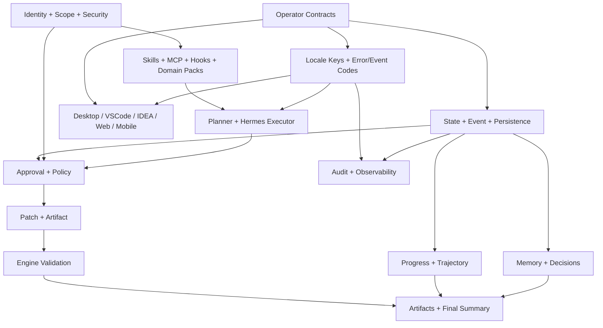

# Hermes Game Operator 完整产品与技术蓝图

> 文档性质：完整目标产品规范，不是分阶段路线图  
> 适用仓库：`D:\dingsun\acp-ui`  
> 执行环境：Claude Code，内部模型 Qwen 3.7 Plus  
> 基准日期：2026-07-10  
> 状态：后续产品、架构、实现、测试和验收的最高优先级依据

## 0. 如何理解这份蓝图

这份文档不使用“先做一个简版，再逐步补齐”的产品定义，也不以 P0、P1、P2 代表最终产品边界。它一次性描述 Hermes Game Operator 成为完整产品时必须具备的能力、合同、不变量、平台体验、语言支持、安全边界和验收证据。

实现工作仍然必须遵守依赖关系，但依赖关系不等于产品被切成互相割裂的阶段。任何模块只有与任务状态、审批、事件、记忆、安全、国际化和跨平台合同连通后，才算产品能力；只有文件、页面或 adapter 存在，不能算完成。

本文使用以下规范词：

- `必须`：缺失即不符合完整产品定义。
- `禁止`：出现即构成安全、数据或产品语义缺陷。
- `应该`：默认要求，偏离时必须记录设计决策与证据。
- `可以`：可选扩展，不得破坏必须项。

完整产品判定遵循集合逻辑：

```text
完整产品 =
  核心任务闭环
  ∩ 操作员控制权
  ∩ 多平台一致性
  ∩ 国际化与可访问性
  ∩ 安全与审计
  ∩ 持久化与恢复
  ∩ 游戏领域能力
  ∩ Skills/MCP/Hooks/Memory 治理
  ∩ 自动化与真实验收
  ∩ 可发布、可升级、可运维
```

只要任一交集为空，就只能报告“部分能力已实现”，不能报告完整产品完成。

## 1. 产品定义

### 1.1 产品使命

Hermes Game Operator 是一个由操作员掌控、可暂停、可恢复、可重定向、可审计的游戏开发 Agent 控制系统。它把大模型的理解与生成能力放在确定性控制面之后，使个人开发者、游戏团队和远程审批者能够让 Agent 参与真实游戏项目，同时保留最终决策权和项目安全边界。

产品不是聊天框套工具，也不是自动点击 IDE。它必须做到：

1. 理解真实项目和任务目标。
2. 把目标拆成可检查计划。
3. 在执行前向操作员解释意图和风险。
4. 只生成受约束、可解析、可审查的候选改动。
5. 在写入前展示精确文件差异。
6. 允许操作员批准、拒绝或要求修改。
7. 对写入执行路径、哈希、备份、并发和回滚校验。
8. 用真实游戏引擎或固定验证器验证结果。
9. 在任意客户端展示同一个任务事实。
10. 在进程重启、网络中断和客户端切换后安全恢复。
11. 记录每个模型、工具、审批和文件动作的因果链。
12. 支持不同语言的操作员、团队和 Agent 产物。

### 1.2 产品边界

Hermes Game Operator 负责：

- 项目注册与边界。
- 任务、目标和目标修订。
- 计划、计划修订和计划审批。
- 执行器编排与取消。
- 结构化补丁、diff、备份、应用和回滚。
- 引擎验证和验证证据。
- 进度、轨迹、记忆、事件和审计。
- Desktop、VSCode、IDEA、Web、移动/IM 客户端协议。
- Skills、MCP、Hooks 和 Domain Pack 的权限治理。
- 本机、局域网和企业远程部署安全。
- UI、错误、事件和 Agent 输出的语言策略。

Hermes Game Operator 不负责：

- 让模型直接拥有终端和项目写权限。
- 用聊天文本替代结构化状态。
- 用客户端本地缓存替代后端事实源。
- 在没有审批证据时声称文件已获授权。
- 自动执行模型提供的任意 validation 命令。
- 把模型推测自动写成长期项目事实。
- 把未受治理的插件、skill 或 MCP 当作可信代码。

### 1.3 成功结果

对操作员：

- 始终知道 Agent 正在做什么、为什么做、下一步是什么。
- 始终能暂停、停止、恢复或改变方向。
- 始终能区分计划授权与文件落盘授权。
- 始终能看到失败原因、已修改文件、备份和回滚位置。
- 可以从桌面、IDE 或远程端接管同一任务。
- 可以使用自己熟悉的语言操作，不被英文硬编码阻断。

对开发团队：

- 项目约定、架构决策和失败经验可复用且有来源。
- 多人审批、权限范围和审计记录清楚。
- Agent 改动可以进入现有 Git、CI、引擎和发布流程。
- 不同 IDE 客户端不会制造不同任务状态。

对企业：

- 身份、权限、项目 scope、密钥、审计和保留策略可配置。
- 公网远程操作有 TLS、OIDC、RBAC、限流和撤销能力。
- 模型供应商、成本、数据区域和敏感信息策略可治理。

## 2. 用户与权限角色

| 角色 | 核心需求 | 默认权限 |
|---|---|---|
| Solo Developer | 在本机快速完成开发闭环 | 创建、控制、审批自己的项目任务 |
| Programmer | 在 IDE 内查看计划、diff、验证 | 项目 scope 内创建与控制；补丁审批按策略 |
| Technical Artist | 处理场景、资源、shader 和导入问题 | 受限资源与场景能力；不能越过项目边界 |
| Designer | 用自然语言描述玩法和参数调整 | 创建任务、查看进度；写入需审批 |
| QA | 复现、验证和记录失败 | 读取任务、触发允许的验证、提交反馈 |
| Lead / Maintainer | 审查架构和高风险改动 | 计划与补丁审批、策略管理 |
| Producer | 查看进度、风险、成本和交付物 | 只读或有限控制，不默认查看敏感源码 |
| Remote Approver | 远程批准、拒绝或要求修改 | 指定项目与动作 scope 内审批 |
| Security Admin | 管理身份、scope、密钥和审计 | 安全策略，不默认拥有项目内容写权 |
| Platform Admin | 部署、升级、备份和监控 | 系统运维，不自动获得任务审批权 |

必须支持 RBAC 与项目级 scope 叠加。角色名称是默认策略模板，最终授权由显式 scope 决定，不得仅凭 UI 角色标签放行。

## 3. 产品不变量

以下不变量在所有平台、语言、引擎和扩展中同时成立。

### INV-001：唯一事实源

任务状态、事件、审批、补丁、验证、记忆引用和审计由 Operator 后端持有。客户端可以缓存只读快照，但不能创建第二个权威状态机。

### INV-002：两级审批

```text
operator.plan.generate_patch
  !=
operator.patch.apply
```

第一次审批只允许执行器根据计划生成候选补丁。第二次审批只授权当前 approval ID、当前 revision、当前哈希和当前逐文件 diff。旧审批不能复用到新计划或新补丁。

### INV-003：模型没有最终写权

模型、Skill、MCP 和 Hook 均不能直接写真实项目。真实写入必须由 Operator 的确定性补丁引擎执行。

### INV-004：模型输出不可信

模型输出必须经过 schema、未知字段、路径、扩展名、大小、数量、哈希、symlink、保护目录和 stale 校验。

### INV-005：操作员随时可介入

所有超过短时阈值的任务必须支持 pause、resume、stop 和 redirect。取消请求必须传播到模型、工具和引擎子进程，并记录传播结果。

### INV-006：验证命令可信

只能执行 Operator 或签名 Domain Pack 定义的固定验证模板。模型返回的 validation 文本只供展示，不能执行。

### INV-007：失败不伪装成功

解析失败、审批失效、文件 stale、写入失败、回滚失败、引擎失败、恢复失败和权限失败必须进入明确失败或阻塞状态，不能被绿色完成状态覆盖。

### INV-008：协议值不翻译

task status、event type、approval action、error code、scope、文件路径、哈希、命令标识和 API 字段必须保持稳定机器值。客户端根据 locale 翻译展示文本。

### INV-009：跨平台同义

Desktop、VSCode、IDEA、Web、移动和 IM 对同一 action、status、approval 和 error code 使用同一产品语义和术语表。

### INV-010：语言不改变授权

切换语言只能改变展示和 Agent 输出偏好，不能改变审批范围、风险级别、路径规则、状态机或安全策略。

## 4. 完整用户旅程

### 4.1 项目接入

1. 操作员选择或注册游戏项目。
2. Operator canonicalize 路径并验证允许根目录。
3. Domain detector 识别 Godot、Unity、Unreal、Ren'Py 或未知项目。
4. UI 展示检测依据、引擎版本、入口场景、脚本语言和可用验证器。
5. 操作员确认项目 profile、默认语言、代码约定、危险目录和验证策略。
6. 项目 profile 生成稳定 `project_id`，不能仅以可变路径作为身份。

### 4.2 创建任务

1. 操作员输入目标、约束、期望结果和禁止事项。
2. 可以附加 issue、设计文档、截图、日志、场景或选中文件。
3. UI 明确显示任务语言、项目、执行模式、审批策略和预算。
4. Operator 生成 task ID 和 goal revision 1。
5. 任务进入 planning，并发出带 sequence 的 append-only event。

### 4.3 计划与第一次审批

1. Planner 读取受限项目上下文和已批准项目记忆。
2. 计划必须包含步骤、涉及区域、预期文件、验证方式、风险和停止点。
3. 计划不能伪装成已经执行。
4. UI 展示计划 revision、生成模型、上下文来源和过期条件。
5. 操作员可以 approve、reject、request_changes 或 redirect goal。
6. request_changes 必须关闭旧 approval，生成新 plan revision 和新 approval ID。

### 4.4 候选改动与第二次审批

1. 只有计划审批通过后，Hermes 执行器才可生成候选补丁。
2. Hermes 使用 no-tools 模式，只返回结构化数据。
3. Operator 读取真实源文件、验证 expected hash、计算 review diff。
4. UI 按文件展示 operation、relative path、语言、大小变化、diff 和风险。
5. 二进制资源只允许通过签名的专用 artifact workflow，不混入文本 patch。
6. 操作员可以逐补丁集 approve、reject 或 request_changes。
7. 审批页面必须在所有支持语言、窗口尺寸和键盘操作下可达。

### 4.5 应用、验证与收口

1. 应用前重新检查 revision、approval、路径和 stale hash。
2. 对 replace 文件集中备份，对 create 文件记录不存在证明。
3. 全量 preflight 通过后才开始批量写入。
4. 写入后重新计算哈希。
5. 任一写入失败时按相反顺序回滚。
6. 引擎验证产生 started、passed、failed 或 skipped 事件。
7. completed 只在补丁应用成功且验证结论符合策略后产生。
8. 最终摘要包含目标、计划、审批、文件、验证、成本、未完成项和回滚位置。

### 4.6 暂停、停止、恢复与改方向

- Pause：取消当前可取消子进程，保存恢复点，不消费未决审批。
- Resume：由操作员显式触发，按恢复来源决定重新计划、重新生成候选或重新验证。
- Stop：关闭当前执行链和未决审批，不自动回滚已获批且已完成的文件改动。
- Redirect：创建新 goal revision，关闭旧计划和旧补丁审批，保留可审计历史。
- Restart Recovery：恢复可观察状态，不在启动时自动 spawn 模型或引擎。

### 4.7 跨客户端接管

1. Desktop 创建任务。
2. VSCode 可以接管查看进度。
3. Web 或移动端可以在有 scope 时审批。
4. IDEA 可以继续查看同一 diff。
5. 所有客户端通过 revision 与 sequence 判断新旧状态。
6. 任一客户端的旧响应不能覆盖服务器已经确认的新状态。

## 5. 完整能力目录

### 5.1 Project Workspace

| ID | 能力 | 合同 |
|---|---|---|
| PRJ-001 | 项目注册 | canonical path、project ID、domain、engine version |
| PRJ-002 | 多项目 | 任务、记忆、scope 和审计严格隔离 |
| PRJ-003 | 项目 profile | 入口、脚本语言、约定、验证器、locale |
| PRJ-004 | 项目健康 | 引擎、依赖、导入、Git、磁盘和锁状态 |
| PRJ-005 | 上下文索引 | 增量、可取消、受大小与敏感目录约束 |
| PRJ-006 | 工作副本 | 可选 Git branch/worktree，明确来源和清理策略 |

### 5.2 Task and Goal

| ID | 能力 | 合同 |
|---|---|---|
| TSK-001 | 创建任务 | goal、constraints、locale、budget、project scope |
| TSK-002 | 目标修订 | append-only revision，不覆盖旧目标 |
| TSK-003 | 控制 | pause/resume/stop/redirect 幂等 |
| TSK-004 | 优先级 | 队列优先级不能越过审批或权限 |
| TSK-005 | 预算 | token、成本、时间、工具和文件上限 |
| TSK-006 | 摘要 | 当前事实与历史事件一致，可重建 |

### 5.3 Plan and Approval

| ID | 能力 | 合同 |
|---|---|---|
| PLN-001 | 结构化计划 | steps、risks、expected files、validation |
| PLN-002 | 计划修订 | 每次 request_changes 产生新 revision |
| APR-001 | 多级审批 | plan、patch、危险工具、发布分别授权 |
| APR-002 | 审批失效 | revision、hash、scope 或 TTL 改变即失效 |
| APR-003 | 审批委托 | 委托人、被委托人、scope、期限可审计 |
| APR-004 | 多人规则 | one-of、all-of、quorum 由策略明确声明 |
| APR-005 | 决策理由 | reject/request_changes 必须支持结构化理由 |

### 5.4 Patch and Artifact

| ID | 能力 | 合同 |
|---|---|---|
| PAT-001 | 文本补丁 | create/replace，完整目标内容，严格 schema |
| PAT-002 | diff | 逐文件、稳定换行、可折叠、可复制 |
| PAT-003 | stale | expected/current hash 不同则拒绝 |
| PAT-004 | 备份 | task/approval/path 可追溯 |
| PAT-005 | 回滚 | 写入失败自动回滚；验证失败由策略决定人工回滚 |
| ART-001 | 二进制 artifact | 独立 manifest、哈希、预览和审批流程 |
| ART-002 | 生成资源 | 来源模型、许可证、prompt、seed 和尺寸可审计 |

### 5.5 Validation

| ID | 能力 | 合同 |
|---|---|---|
| VAL-001 | 引擎检查 | 固定模板，不执行模型字符串 |
| VAL-002 | 静态检查 | GDScript/C#/C++/shader 对应工具链 |
| VAL-003 | 测试 | 项目声明的允许测试目标 |
| VAL-004 | 运行 smoke | 超时、取消、输出截断、进程树回收 |
| VAL-005 | 结果分类 | passed/failed/skipped/cancelled/timed_out |
| VAL-006 | 证据 | 命令模板 ID、工具版本、退出码、日志 artifact |

### 5.6 Progress, Memory and Trajectory

| ID | 能力 | 合同 |
|---|---|---|
| OBS-001 | 实时进度 | 当前步骤、已完成、下一步、阻塞 |
| OBS-002 | 工具活动 | 工具、目标、耗时、结果、是否可取消 |
| OBS-003 | 预算 | token、费用、时间和上下文使用 |
| OBS-004 | 记忆命中 | 来源、scope、可信度、更新时间 |
| OBS-005 | 最终走向 | 当前路线、偏离原因、预测产物、风险 |
| OBS-006 | 恢复信息 | recovery origin、上次进程、显式 resume 要求 |

## 6. 领域数据模型

### 6.1 核心实体

```text
Project
ProjectProfile
Task
GoalRevision
PlanRevision
PlanStep
ApprovalRequest
ApprovalDecision
ExecutionAttempt
ExecutionLease
PatchSet
FileChange
Artifact
BackupRecord
ValidationRun
OperatorEvent
MemoryRecord
DecisionRecord
CapabilityManifest
HookRun
McpCall
ClientSession
Identity
RoleBinding
AuditRecord
LocalePreference
```

### 6.2 关键字段合同

#### Project

```text
project_id: stable UUID
canonical_path: absolute canonical D path in current deployment policy
display_name: user text
domain: game.godot | game.unity | game.unreal | game.renpy | ...
engine_version: detected version
profile_revision: integer
default_locale: BCP 47
created_at / updated_at: RFC 3339 UTC
```

#### Task

```text
task_id
project_id
current_goal_revision
current_plan_revision?
current_patch_revision?
status
status_revision
approval_policy_id
execution_policy_id
ui_locale
task_language
artifact_language
budget
created_by
created_at / updated_at
```

#### OperatorEvent

```text
event_id
task_id
sequence
event_type                 # 稳定机器值
level
message_key                # 如 operator.event.plan_ready
message_args               # 结构化、可校验参数
fallback_text              # 兼容旧客户端，不作为权威语义
payload
source
correlation_id
causation_id
timestamp
```

#### ApprovalRequest

```text
approval_id
task_id
approval_type
action                     # 稳定机器值
subject_revision
subject_hash
scope
risk_code
title_key / title_args
reason_key / reason_args
preview
options
policy
expires_at?
created_at
resolved_at?
decision?
resolved_by?
```

#### MemoryRecord

```text
memory_id
project_id
scope: task | project | team | user
kind: fact | decision | failure | preference | pattern
content
source_refs
confidence
status: proposed | approved | superseded | rejected
locale
created_by
created_at
supersedes?
```

### 6.3 标识与版本

- 所有实体使用不可猜测 ID。
- sequence 在单 task 内严格连续。
- revision 单调递增，不允许客户端指定回退。
- 客户端写操作携带 `expected_revision` 或 ETag。
- 重试写操作携带 `Idempotency-Key`。
- 审计记录携带 actor、client、request、correlation 和结果。

## 7. 状态机

### 7.1 任务状态

```text
idle
planning
waiting_approval
running
paused
redirecting
validating
cancelling
completed
failed
cancelled
blocked
```

目标状态机必须显式纳入 `validating` 与 `blocked`。旧客户端未知状态时展示“未知状态”与原始机器值，不得默认为 completed。

### 7.2 合法转换

| From | Action / Event | To | 约束 |
|---|---|---|---|
| idle | start planning | planning | project 与 policy 已验证 |
| planning | plan ready | waiting_approval | 创建 plan approval |
| planning | pause | paused | 取消 planner |
| planning | stop | cancelling -> cancelled | 关闭本轮 attempt |
| waiting_approval | approve plan | running | 只允许生成候选补丁 |
| waiting_approval | request changes | planning | 新 revision、新 approval |
| waiting_approval | approve patch | running | stale preflight 后应用 |
| running | patch proposed | waiting_approval | 创建 patch approval |
| running | patch applied | validating | 验证策略要求时 |
| running | pause | paused | 保存 resume checkpoint |
| paused | resume | planning/running/validating | 由 checkpoint 决定 |
| any active | redirect | redirecting -> planning | 新 goal revision |
| any active | stop | cancelling -> cancelled | 传播取消 |
| validating | pass | completed | 证据持久化后 |
| validating | fail | failed | 保留文件与备份 |
| active | recover after crash | paused/blocked | 禁止自动 spawn |

### 7.3 禁止转换

- waiting_approval 不能直接 completed。
- planning approval 不能直接修改文件。
- failed 不能由旧 polling 响应改回 running。
- terminal 状态不能 resume，除非创建显式 retry task/attempt。
- approval 已解决后不能再次决策。
- redirect 后旧 plan、patch 和 approval 不能继续生效。

### 7.4 并发控制

- 每个 task 有单一 execution lease。
- lease 包含 owner、attempt、heartbeat、expires_at 和 fencing token。
- 后端使用 status revision 拒绝旧客户端写入。
- pause/stop/redirect 返回确认 revision。
- 客户端 polling 只接受 revision 不小于本地已确认 revision 的快照。
- WebSocket reconnect 从 `last_sequence + 1` 补事件，不能静默丢事件。

## 8. Agent 执行体系

### 8.1 逻辑角色

```text
Operator Controller
  ├── Context Builder
  ├── Planner
  ├── Proposal Executor (Hermes no-tools)
  ├── Policy Engine
  ├── Patch Engine
  ├── Validation Runner
  ├── Memory Curator
  └── Summary Builder
```

这些是逻辑职责，可以由同一进程或不同 worker 实现，但权限必须按职责隔离。

### 8.2 Context Builder

必须：

- 只读取项目 allowlist 内内容。
- 过滤 secret、缓存、构建、VCS 和 Operator 数据目录。
- 记录每个上下文片段来源与哈希。
- 对文本大小、文件数、目录遍历和总 token 设上限。
- 把项目文件标记为不可信数据，抵抗 prompt injection。
- 优先检索与目标相关的入口、依赖和既有约定。

### 8.3 Planner

计划输出必须是结构化 schema，包含：

- 对目标的解释。
- 前置假设。
- 步骤和依赖。
- 预计读写区域。
- 风险和失败条件。
- 验证策略 ID。
- 需要操作员决定的问题。
- 是否需要额外 skill/MCP scope。

### 8.4 Proposal Executor

Hermes Game 提案合同保持：

```text
hermes-game --engine <engine> codegen controlled-proposal-request \
  --output <artifact.json> \
  --no-tools \
  --prompt-file <request.txt>
```

执行器不能访问终端、项目写工具或未批准 MCP。超时、取消、stdout/stderr 和 artifact 都必须受限并可审计。

### 8.5 Model Provider

模型供应商是可替换依赖，不得进入任务状态机语义。Provider contract 至少包含：

- model ID 和版本。
- region 与数据保留策略。
- streaming、tool use、structured output 能力。
- token/cost accounting。
- timeout、cancel 和 retry。
- safety/error mapping。
- output locale 支持。

切换模型不能改变审批 action、patch schema 或安全策略。

### 8.6 多 Agent 编排

多 Agent 是同一 Operator task 内的受控执行图，不是多个互不知情的聊天会话。逻辑角色可以包括：

```text
Project Analyst
Planner
Gameplay Implementer
Scene/UI Implementer
Asset Specialist
Test Designer
Validation Runner
Code Reviewer
Security Reviewer
Summary Curator
```

编排合同：

- 任务只有一个权威状态机和一个操作员控制面。
- 每个 worker 获得最小 project/task scope。
- worker 输出进入结构化 result/artifact，不直接改变 task 状态。
- 并行读取和分析可以并发；真实写入必须经过同一 patch queue 串行 fencing。
- worker 之间传递的是 schema 化产物和 provenance，不是不可审计的隐式上下文。
- reviewer 的同意不能替代人类审批，除非 policy 明确将该动作设为自动允许且不涉及真实写入。
- 一个 worker 失败不自动取消全部任务；编排图明确 required、optional 和 fallback node。
- pause/stop/redirect 必须传播到整个 worker graph。
- 每个 worker 的模型、token、成本、上下文、工具和 locale 单独记录。
- 不向用户展示隐藏推理链，只展示角色、输入来源、结构化结论和证据。

### 8.7 工具类别与权限矩阵

| 工具类别 | 示例 | 默认权限 | 结果处理 |
|---|---|---|---|
| Project Read | tree、search、read text | silent/notify | 标记来源与 taint |
| Static Analyze | parser、AST、lint read | silent/notify | 结构化 diagnostics |
| Context Retrieve | memory、issue、docs | notify | provenance + scope |
| Proposal | plan、structured patch | plan approval 后允许 | 不写项目 |
| Project Write | apply patch、binary import | approve | 仅 Operator 执行 |
| Engine Validate | Godot headless、Unity batchmode | policy controlled | 固定模板与 artifact |
| VCS Read | status、diff、log | notify | 不改变 repo |
| VCS Write | branch、commit、push、PR | approve/forbidden | 独立 action 与审计 |
| Network Read | issue tracker、asset catalog | scope controlled | 响应不可信 |
| Network Write | issue update、upload、publish | approve | 幂等与回滚策略 |
| Asset Generate | image、audio、video、3D | approve by cost/policy | provenance manifest |
| Release | export、sign、publish | multi-approve | 高风险独立 workflow |

`silent`、`notify`、`approve`、`forbidden` 是 policy 结果，不由 skill 自己决定。任何工具声明与实际副作用不一致时拒绝加载并记录安全事件。

## 9. 游戏领域完整能力

### 9.1 通用游戏项目能力

- 项目结构与入口分析。
- Gameplay 逻辑修改。
- 输入、角色、相机和状态机。
- 场景、关卡和资源引用。
- UI、HUD、本地化和可访问性。
- 存档、配置和数据迁移。
- shader、材质和渲染设置。
- 动画、音频和时间轴引用。
- 性能分析与预算建议。
- 测试、调试和错误复现。
- 构建、导出和发布准备。
- 版本控制影响与变更摘要。

### 9.2 Godot Domain Contract

必须识别：

- `project.godot`。
- `.gd`、`.cs`、`.tscn`、`.tres`、`.gdshader`。
- autoload、input map、plugins、entry scene。
- Godot 版本、renderer、script language。

必须验证：

- headless editor import/parser。
- GDScript/C# 编译或解析。
- 资源引用与场景加载。
- 项目声明的自动化测试。
- 可选运行 smoke。

### 9.3 Unity Domain Contract

目标合同包括：

- `ProjectSettings`、`Packages/manifest.json`、`Assets`。
- C#、asmdef、scene、prefab、ScriptableObject 元数据。
- `.meta` GUID 一致性。
- Unity batchmode 固定验证模板。
- 禁止模型手工伪造 GUID 或直接生成未知二进制资产。

### 9.4 Unreal Domain Contract

目标合同包括：

- `.uproject`、Modules、Plugins、Config、Content 引用。
- C++、Build.cs、Target.cs 和文本配置。
- UBT/UHT 固定验证。
- `.uasset` 通过专用 artifact/editor bridge，不进入文本 patch。

### 9.5 Ren'Py Domain Contract

目标合同包括：

- `.rpy` 脚本、label、screen、translation 和 persistent data。
- lint 固定验证。
- 对翻译目录和语言 key 的完整性检查。

不同引擎共享 Operator、审批、事件、记忆、语言、安全和审计，只替换 domain detector、context collector、artifact handler 与 validation runner。

### 9.6 非游戏领域扩展合同

Operator Core 设计必须允许未来领域复用，但非游戏 Domain Pack 不得污染当前 Game Agent 的上下文、导航和完成统计。

| 领域 | 受控产物 | 确定性验证 | 典型审批对象 |
|---|---|---|---|
| 传统软件开发 | source patch、migration、config | build/test/lint/typecheck | 代码 diff、迁移、发布 |
| 视频创作 | script、shot list、timeline、render artifact | media probe、timeline schema、render check | 素材、剪辑、渲染、发布 |
| 漫画创作 | script、storyboard、panel、layered assets | page/panel schema、尺寸、字体、导出 | 角色一致性、画面、文字、发布 |
| 运营 | content plan、copy、calendar、channel payload | schema、链接、时间、平台 preview | 内容、排期、渠道发布 |
| 企业流程 | record change、workflow action、report | API schema、business rules、transaction | 数据修改、付款、权限、提交 |

每个领域必须提供：

- Domain detector/profile。
- Artifact schema 和 preview。
- Side-effect policy。
- Validation runner。
- Locale glossary。
- Memory types。
- Platform-specific approval UI metadata。
- Rollback/compensation 语义。

核心原则不变：模型生成候选，Operator 校验和执行，操作员拥有最终控制权。

## 10. 平台产品合同

### 10.1 平台能力矩阵

| 能力 | Tauri Desktop | VSCode | IDEA | Web | 移动/IM |
|---|---|---|---|---|---|
| 项目注册 | 完整 | 当前 workspace | 当前 project | 受 scope 限制 | 不默认允许 |
| 创建任务 | 是 | 是 | 是 | 是 | 策略允许时 |
| 计划审批 | 是 | 是 | 是 | 是 | 是 |
| 逐文件 diff | 内置 | VSCode diff | IDE DiffManager | Web diff | 摘要+深链 |
| 补丁审批 | 是 | 是 | 是 | 是 | 高风险可禁用 |
| Pause/Resume/Stop/Redirect | 是 | 是 | 是 | 是 | 策略允许时 |
| 项目文件打开 | 本地 | 原生 | 原生 | 不直接 | 不直接 |
| Memory/Trajectory | 完整 | 完整 | 完整 | 完整 | 摘要 |
| Audit | 管理权限 | 受限 | 受限 | 完整管理 | 通知级 |
| 设置与密钥 | 系统安全存储 | SecretStorage | PasswordSafe | HttpOnly/session | 平台安全存储 |
| 离线只读缓存 | 是 | 是 | 是 | 可选 | 可选 |

### 10.2 Tauri Desktop

- 是本机完整控制面，不是 Web 页面包装演示。
- 负责本地 runtime、项目选择、日志、备份和 engine discovery。
- 使用系统密钥存储保存远程凭据。
- WebView2 profile、SQLite 和 config 路径可显式配置。
- 所有核心操作键盘可达。
- 1024x720、1280x800、1440x900 以及高 DPI 下可用。

### 10.3 VSCode

- 使用 Remote Operator API，不嵌入状态机。
- workspace folder 映射 project ID/path。
- Token 存 SecretStorage。
- 使用 TreeView/WebviewView 展示任务、进度、审批和记忆。
- 使用 TextDocumentContentProvider + diff editor 展示候选内容。
- ACP 应用文件后，扩展刷新 workspace，不自行写入。
- 遵循 `vscode.env.language` 并允许覆盖任务输出语言。

### 10.4 IDEA

- Kotlin + IntelliJ Platform。
- `Project.basePath` 只用于项目映射。
- Token 存 PasswordSafe。
- ToolWindow 展示同一任务事实。
- 使用 DiffManager 展示补丁。
- 网络在后台，UI 回 EDT。
- 遵循 IDE locale，不通过 PSI 绕过 Operator 写入。

### 10.5 Web

- 支持任务、审批、timeline、memory、trajectory 和 audit。
- 浏览器不持有长期 bearer token 明文。
- 使用 OIDC/session 或短期 access token。
- WebSocket 使用首帧认证或一次性 ticket，禁止 query token。
- 对源码和 diff 应用 CSP、下载与剪贴板策略。
- 根据 `navigator.languages` 和账户偏好选择 locale。

### 10.6 移动与 IM

- 适合通知、摘要、审批和紧急停止，不是完整代码编辑器。
- 高风险补丁可以要求跳转 Desktop/IDE/Web 完成。
- 消息卡必须展示项目、task、approval type、revision、风险和过期时间。
- 回调使用签名、nonce、TTL 和幂等 key。
- 平台文本长度截断不能改变审批语义。

## 11. 信息架构与操作员界面

### 11.1 顶层信息架构

```text
Projects
Tasks
Operator
Approvals
Memory
Capabilities
Artifacts
Audit
Settings
```

顶层导航按操作对象组织，不按内部技术模块或 demo 功能组织。

### 11.2 Operator 主界面

固定包含：

1. Task Header
   - 项目、目标、状态、revision、执行器和远程连接。
2. Control Bar
   - Pause、Resume、Stop、Redirect，状态决定可用性。
3. Plan
   - 当前计划、步骤、依赖、完成状态和修订历史。
4. Progress Timeline
   - append-only 事件、当前工具、耗时与结果。
5. Approvals
   - 计划审批、补丁审批和危险工具审批。
6. Memory
   - 本任务使用的事实、决策、偏好与来源。
7. Trajectory
   - 当前路线、原目标、操作员重定向、偏离和预期结果。
8. Artifacts
   - diff、补丁、备份、日志、截图、验证报告和最终摘要。

### 11.3 Trajectory 最终走向面板

该面板不是模型“心理活动”，而是可审计的任务方向摘要：

```text
Original Goal
Current Goal Revision
Approved Plan Revision
Current Step
Completed Outcomes
Pending Decisions
Known Risks
Direction Changes
Expected Deliverables
Validation Strategy
Completion Criteria
Unresolved Items
```

所有项从结构化任务、计划、审批和事件生成，不展示未验证的隐藏推理链。

### 11.4 交互规则

- 命令按钮使用图标或图标+文字，危险操作有明确文案。
- 状态不能只依赖颜色，必须有文本和图标。
- 不允许卡片套卡片造成层级混乱。
- 固定格式控件有稳定尺寸，不因状态文本改变布局。
- 长路径、长目标、长 diff 和德语等扩展文本不能撑破容器。
- 页面只保留一个明确的主纵向滚动宿主。
- diff 代码区可以独立横向滚动，但不能造成整页横向滚动。
- 对话框和 drawer 打开时管理焦点、Escape、焦点回归和屏幕阅读器标题。
- 触控目标不小于 44x44 CSS px，桌面紧凑模式可使用 36px 但必须支持键盘。

### 11.5 响应式合同

| 容器宽度 | 结构 |
|---|---|
| >= 1200 内容宽 | Plan / Timeline / Approval 三列 |
| 800-1199 内容宽 | Plan + Timeline 主区，Approval 可停靠或下置 |
| < 800 内容宽 | 单列，固定控制条，统一页面滚动 |

断点基于 Operator 容器宽度，不基于整窗宽度，因为侧栏、IDE tool window 和 Web 嵌入区域会改变实际空间。

## 12. 国际化与本地化完整合同

### 12.1 当前事实

项目已经使用 `vue-i18n`，并存在 11 个语言包：

```text
zh-CN  简体中文
en-US  English
de-DE  Deutsch
es-ES  Español
ru-RU  Русский
ja-JP  日本語
ko-KR  한국어
vi-VN  Tiếng Việt
th-TH  ไทย
ms-MY  Bahasa Melayu
fr-FR  Français
```

现有基础包括：

- `src/locales/types.ts` 类型安全 MessageSchema。
- `src/locales/index.ts` 初始 locale、fallback 和动态加载。
- `LanguageSelector.vue`。
- localStorage 偏好。

当前缺陷：Game Operator 没有接入这套系统，核心页面和组件硬编码英文；后端事件和错误也大量携带渲染后的英文字符串。

### 12.2 完整语言目录

完整产品内置并通过质量门的 locale 定义为：

```text
zh-CN, zh-TW,
en-US,
ja-JP, ko-KR,
de-DE, fr-FR, es-ES, pt-BR,
ru-RU,
vi-VN, th-TH, ms-MY, id-ID,
ar-SA
```

同时支持符合 manifest 合同的外部 locale pack。内置语言数量不限制架构，任何 BCP 47 locale 都可以通过同一 key schema 接入。

Locale descriptor 必须是结构化数据：

```ts
interface LocaleDescriptor {
  code: string                // BCP 47，例如 zh-CN
  nativeName: string          // 简体中文
  englishName: string         // Simplified Chinese
  direction: 'ltr' | 'rtl'
  fallbacks: string[]
  fontFamilies: string[]
  messageSchemaVersion: number
  translationVersion: string
  quality: 'draft' | 'reviewed' | 'production'
  reviewer?: string
  updatedAt: string
}
```

语言选择器必须优先显示 `nativeName`，可以辅以地区文本，但不能把国旗当作语言身份。英语、西班牙语、中文等跨多个国家或地区，当前 `SUPPORTED_LANGS.flag` 只能作为临时装饰，不能成为完整产品合同或唯一识别方式。

每个内置 locale 必须满足：

- 100% 必填 key 覆盖。
- ICU 参数与基准语言完全一致。
- 无空字符串和未审查 fallback。
- 核心审批、安全、错误和恢复术语经人工复核。
- 截图和文本扩展测试通过。
- 对应日期、数字、列表、复数和相对时间格式通过。

### 12.3 Locale 选择与回退

优先级：

```text
任务显式 UI locale
  > 用户账户偏好
  > 当前客户端偏好
  > 操作系统/IDE/浏览器 locale
  > language-family 匹配
  > en-US fallback
```

示例：

```text
pt-PT -> pt-BR -> en-US
zh-HK -> zh-TW -> zh-CN -> en-US
fr-CA -> fr-FR -> en-US
```

切换 locale 必须：

- 无需重启 UI。
- 更新 `document.documentElement.lang`。
- 根据 locale 更新 `dir=ltr|rtl`。
- 不重置当前任务或滚动状态。
- 不重新提交任何写操作。
- 保存到账户或客户端偏好。
- 对 Remote 请求发送 `Accept-Language`，但客户端仍以稳定 key 本地渲染为主。

### 12.4 四种语言概念必须分离

| 设置 | 含义 | 示例 |
|---|---|---|
| `ui_locale` | 按钮、状态、错误和日期的界面语言 | `zh-CN` |
| `task_language` | Agent 与操作员解释任务的语言 | 中文 |
| `artifact_language` | 文档、注释、提交摘要等产物语言 | English |
| `source_language` | 编程语言或项目原始文本语言 | GDScript / C#，不自动翻译标识符 |

用户可以使用中文界面，让 Agent 用中文解释，但要求代码注释和 README 输出英文。四种设置不能被合并成单一 `locale`。

### 12.5 MessageSchema 命名空间

必须增加并固定：

```text
gameOperator.header.*
gameOperator.project.*
gameOperator.task.*
gameOperator.controls.*
gameOperator.plan.*
gameOperator.progress.*
gameOperator.approval.*
gameOperator.patch.*
gameOperator.validation.*
gameOperator.memory.*
gameOperator.trajectory.*
gameOperator.remote.*
gameOperator.recovery.*
gameOperator.artifacts.*
operatorStatus.*
operatorEvent.*
operatorError.*
approvalAction.*
approvalDecision.*
approvalRisk.*
engine.godot.*
engine.unity.*
engine.unreal.*
engine.renpy.*
a11y.gameOperator.*
```

禁止用完整英文句子当 key。key 表达语义，不表达某一种语言的措辞。

Game Operator 的最低键级合同：

```ts
interface GameOperatorMessages {
  header: {
    title: string
    subtitle: string
    projectAndTask: string
  }
  remote: {
    checking: string
    online: string
    offline: string
    platforms: string          // ICU plural
    reconnecting: string
    lastEvent: string
    connectionError: string
  }
  project: {
    pathLabel: string
    pathPlaceholder: string
    browse: string
    detecting: string
    invalidProject: string
    outsideAllowedRoots: string
    engineDetected: string
  }
  task: {
    goalLabel: string
    goalPlaceholder: string
    start: string
    starting: string
    taskId: string
    domain: string
    revision: string
    createdBy: string
  }
  controls: {
    pause: string
    pausing: string
    resume: string
    resuming: string
    stop: string
    stopping: string
    redirect: string
    redirecting: string
    redirectGoalLabel: string
    redirectGoalPlaceholder: string
    stopConfirmTitle: string
    stopConfirmBody: string
  }
  plan: {
    title: string
    goal: string
    revision: string
    assumptions: string
    risks: string
    expectedFiles: string
    validation: string
    noPlan: string
    stepDone: string
    stepCurrent: string
    stepFailed: string
    stepNext: string
  }
  progress: {
    title: string
    noEvents: string
    currentStep: string
    elapsed: string
    activeDuration: string
    pausedDuration: string
    toolCalls: string
    tokenUsage: string
    cost: string
  }
  approval: {
    title: string
    empty: string
    action: string
    reason: string
    risk: string
    files: string
    expiresAt: string
    requestedBy: string
    approve: string
    reject: string
    requestChanges: string
    commentLabel: string
    commentPlaceholder: string
    submitting: string
    stale: string
    alreadyResolved: string
  }
  patch: {
    summary: string
    operation: string
    create: string
    replace: string
    sourceHash: string
    targetHash: string
    diff: string
    showDiff: string
    hideDiff: string
    addedLines: string
    removedLines: string
    binaryArtifact: string
  }
  validation: {
    title: string
    notStarted: string
    running: string
    passed: string
    failed: string
    skipped: string
    cancelled: string
    timedOut: string
    commandTemplate: string
    engineVersion: string
    viewLog: string
  }
  recovery: {
    title: string
    restored: string
    interrupted: string
    requiresResume: string
    sourceProcess: string
    recoveredAt: string
  }
  memory: {
    title: string
    empty: string
    source: string
    confidence: string
    approved: string
    proposed: string
    superseded: string
    correct: string
  }
  trajectory: {
    title: string
    originalGoal: string
    currentGoal: string
    directionChanges: string
    completedOutcomes: string
    pendingDecisions: string
    expectedDeliverables: string
    unresolvedItems: string
  }
  artifacts: {
    title: string
    backup: string
    validationLog: string
    patch: string
    summary: string
    openLocation: string
  }
  errors: {
    unknown: string
    loadTaskFailed: string
    startTaskFailed: string
    controlFailed: string
    approvalFailed: string
    redirectFailed: string
    localeLoadFailed: string
  }
  a11y: {
    taskStatus: string
    remoteStatus: string
    progressAnnouncement: string
    approvalRequired: string
    approvalDecisionResult: string
    openDiffForFile: string
    closeDialog: string
  }
}

interface OperatorEnumMessages {
  status: Record<OperatorTaskStatus | 'unknown', string>
  approvalDecision: Record<ApprovalDecision | 'unknown', string>
  approvalLevel: Record<ApprovalLevel | 'unknown', string>
  eventType: Record<OperatorEventType | 'unknown', string>
  errorCode: Record<string, string>
}
```

键级合同可以新增，但删除或改名必须提升 locale schema version 并提供迁移/兼容映射。所有客户端从同一 contract package 生成或校验 key，不各自维护副本。

### 12.6 协议层本地化

后端必须发送稳定 code/key/args，而不是要求每个客户端解析英文：

```json
{
  "code": "operator.approval.stale",
  "message_key": "operatorError.approvalStale",
  "message_args": {
    "path": "scripts/player.gd"
  },
  "fallback_text": "The file changed after approval.",
  "retryable": false,
  "trace_id": "trace_..."
}
```

事件同样使用：

```json
{
  "type": "plan_ready",
  "message_key": "operatorEvent.planReady",
  "message_args": {
    "stepCount": 4
  }
}
```

规则：

- code、key、args 持久化并进入审计。
- fallback_text 只为旧客户端和 CLI，可固定英文。
- 客户端不允许通过字符串匹配判断错误类型。
- args 必须有 schema，禁止把任意 HTML 放入翻译参数。
- path、hash、task ID、approval ID、scope 和命令 ID 原样显示，不翻译。

### 12.7 Agent 输出本地化

Agent prompt 必须显式携带：

```text
operator_ui_locale
task_explanation_language
artifact_language
project_naming_conventions
do_not_translate_identifiers
do_not_translate_paths
```

Agent 生成结构化补丁时：

- schema 字段始终英文机器值。
- `summary` 与人类说明使用 task/artifact language。
- 源码标识符遵循项目约定，不按 UI locale 擅自翻译。
- 用户可要求本地化游戏文本，但必须作为明确任务范围。
- 翻译游戏内容时保留 key、placeholder、markup 和 plural 语义。

### 12.8 格式化

必须统一使用 Intl 或平台等价 API：

- `Intl.DateTimeFormat`。
- `Intl.NumberFormat`。
- `Intl.RelativeTimeFormat`。
- `Intl.ListFormat`。
- `Intl.PluralRules` / ICU plural。

禁止：

- `toLocaleTimeString('zh-CN')` 这种硬编码 locale。
- 手工拼接“1 files”或“2 分钟前”。
- 固定月/日/年顺序。
- 以逗号手工拼接多语言列表。

时间持久化使用 UTC RFC 3339；客户端按 locale 和用户时区显示，并提供查看原始时间的方式。

### 12.9 RTL 与字体

`ar-SA` 和未来 RTL locale 要求：

- 根元素设置 `dir=rtl`。
- CSS 使用 `margin-inline`、`padding-inline`、`inset-inline`、`border-inline`。
- 只有具有方向含义的箭头镜像；播放、代码、品牌和 undo/redo 按平台规范处理。
- 路径、代码、hash、diff 保持 LTR 隔离，可使用 `dir=ltr` 与 bidi isolation。
- 图表时间轴和进度方向根据语义而非简单 transform 决定。

字体栈必须覆盖 Latin、CJK、Cyrillic、Thai、Vietnamese、Malay 和 Arabic，不能依赖单一西文字体。代码和 diff 使用支持目标脚本的等宽 fallback。

### 12.10 文本扩展与布局

所有紧凑控件按至少 40% 文本扩展设计。必须测试：

- 德语长复合词。
- 法语和西班牙语按钮扩展。
- 俄语/Cyrillic。
- 泰语无空格断行。
- 中文/日文/韩文 CJK 断行。
- Arabic RTL。
- 200% 系统字体缩放。

增加伪 locale：

```text
en-XA  扩展、重音和占位符检查
ar-XB  RTL 与 bidi 检查
```

任何依赖固定英文宽度的按钮、badge、状态条和审批卡都必须在伪 locale 下失败测试。

### 12.11 术语表

核心术语在所有平台必须一致：

| Machine concept | zh-CN | en-US | 说明 |
|---|---|---|---|
| operator | 操作台 / Operator | Operator | 指控制系统，不翻译为普通接线员 |
| task | 任务 | Task | 有稳定 task ID |
| goal | 目标 | Goal | 可产生 revision |
| plan | 执行计划 | Execution Plan | 不代表已写入 |
| proposal | 候选改动 | Proposal | 模型建议，未落盘 |
| patch approval | 文件改动审批 | Patch Approval | 具体 diff 授权 |
| request_changes | 要求修改 | Request changes | 关闭旧审批并产生新 revision |
| redirect | 改变方向 | Redirect | 创建新 goal revision |
| pause | 暂停 | Pause | 可恢复 |
| stop | 停止 | Stop | 终止当前任务执行 |
| stale | 内容已变化 | Stale | 审批后源文件已改变 |
| validation | 引擎验证 | Validation | 固定模板执行 |
| recovery | 恢复状态 | Recovery | 不等于自动继续执行 |
| memory | 项目记忆 | Memory | 有来源与 scope 的事实/决策 |
| trajectory | 任务走向 | Trajectory | 可审计方向，不是隐藏推理 |

完整 glossary 作为机器可读文件维护，翻译不得随页面自由变化。

### 12.12 Game Operator 当前硬编码修复范围

必须接入 `useI18n()` 的文件：

```text
src/features/game-operator/views/GameOperatorView.vue
src/features/game-operator/components/OperatorControlBar.vue
src/features/game-operator/components/PlanPanel.vue
src/features/game-operator/components/ProgressTimeline.vue
src/features/game-operator/components/ApprovalDrawer.vue
```

当前硬编码包括但不限于：

- 标题、副标题、项目路径、任务目标、Browse、Start Task。
- Remote online/offline/checking。
- Redirect Goal 和 placeholder。
- Execution Plan、Goal、Done/Now/Failed/Next。
- Progress Timeline、No events yet。
- Pending Approvals、Risk、Files。
- Approve、Reject、Request changes。
- Pause、Resume、Stop。
- 状态 `toUpperCase()`。
- 固定 `zh-CN` 时间格式。
- 前端捕获错误后的英文 fallback。
- `src-tauri/src/operator/error.rs` 中直接拼装英文 user message 和 severity emoji。
- Remote API 当前 `{ error?: string, code?: number }` envelope，缺少稳定 message key、args、trace 和 retryable。

系统生成内容与自由文本必须区分：

- task goal、操作员 comment：保留用户原文，并记录 language metadata。
- 模型生成的 plan step、summary、reason：使用 task/artifact language，同时保留机器类型。
- 系统 event、status、approval action、error：只持久化稳定 key/code/args，由客户端本地化。
- path、hash、ID、scope、enum：原样显示，不翻译。

替换后不得把机器枚举直接作为翻译 key；必须通过显式映射，未知值使用通用 unknown + 原始 code。

### 12.13 语言质量与自动化

必须建立：

1. locale key 完整性测试。
2. 所有 locale placeholder 集合一致性测试。
3. ICU message 语法测试。
4. 禁止空值、禁止未声明 key。
5. Game Operator 硬编码可见文本扫描。
6. pseudo-locale screenshot tests。
7. RTL Playwright tests。
8. 每个 locale 的核心审批流程 component tests。
9. VSCode、IDEA、Web 的术语合同测试。
10. 翻译来源、reviewer、更新时间和质量状态元数据。

语言包可以由机器辅助生成，但审批、安全、错误、恢复和数据损失相关文案必须人工复核后才能标为 production-ready。

## 13. Remote Operator API 完整合同

### 13.1 API 原则

- API 是 Desktop、VSCode、IDEA、Web、移动和 IM 的共同产品合同。
- Tauri invoke 可以作为本机 transport，但语义、类型和错误必须与 Remote API 一致。
- API 使用显式版本，例如 `/api/operator/v1`，不能依赖客户端猜测后端版本。
- 读操作可以重试，写操作必须使用 idempotency key 和 revision guard。
- 所有响应包含 request/trace ID。
- 所有用户可见错误使用稳定 error code、message key 和 args。
- 所有列表支持稳定排序、cursor pagination 和 scope 过滤。
- 时间统一为 UTC RFC 3339。

### 13.2 资源模型

完整资源定义：

```text
/projects
/projects/{project_id}
/projects/{project_id}/profile
/tasks
/tasks/{task_id}
/tasks/{task_id}/goals
/tasks/{task_id}/plans
/tasks/{task_id}/events
/tasks/{task_id}/approvals
/tasks/{task_id}/patches
/tasks/{task_id}/validations
/tasks/{task_id}/artifacts
/tasks/{task_id}/memories
/tasks/{task_id}/trajectory
/tasks/{task_id}/summary
/tasks/{task_id}/commands/{pause|resume|stop|redirect|retry}
/approvals/{approval_id}/decision
/capabilities
/skills
/mcp-servers
/hooks
/audit
/identity/me
/settings/localization
```

现有 `/api/operator/tasks` 等路由可以兼容保留，但新客户端必须通过能力协商知道支持的 API version 和 feature flags。

### 13.3 错误 envelope

```json
{
  "error": {
    "code": "operator.patch.stale",
    "message_key": "operatorError.patchStale",
    "message_args": {
      "path": "scripts/player.gd"
    },
    "category": "state",
    "severity": "error",
    "retryable": false,
    "task_id": "task_...",
    "trace_id": "trace_..."
  }
}
```

HTTP status 与 domain code 分离：

| HTTP | 用途 |
|---|---|
| 400 | schema/参数错误 |
| 401 | 未认证 |
| 403 | scope/RBAC 拒绝 |
| 404 | 资源不存在或对当前 scope 隐藏 |
| 409 | revision、state、stale、idempotency 冲突 |
| 410 | approval/lease 已过期 |
| 422 | domain validation 不通过 |
| 429 | 限流或预算 |
| 503 | runtime/provider 暂不可用 |

客户端禁止用 `error.message` 字符串判断业务分支。

### 13.4 幂等与并发

写请求 header：

```text
Idempotency-Key: <UUID>
If-Match: "task-revision-42"
X-ACP-Operator-Client: vscode-main
X-ACP-Request-Locale: zh-CN
```

服务端：

- 同 key、同 payload 返回原结果。
- 同 key、不同 payload 返回 409。
- revision 不匹配返回当前 revision 和可刷新链接。
- approval decision 只接受一次。
- pause/stop 重复请求返回已确认状态，不创建冲突事件。

### 13.5 事件传输

支持：

- HTTP cursor polling。
- WebSocket 或 SSE 流。
- 重连补发。

客户端发送 `last_sequence`，服务端必须：

- 从下一 sequence 补发。
- 缺口超出保留范围时返回 snapshot-required。
- 不重新排序。
- 不把 heartbeat 当作 task event。
- 每个 event 带 correlation/causation。

### 13.6 Locale 协商

```text
Accept-Language: zh-CN,zh;q=0.9,en-US;q=0.7
Content-Language: en-US       # 只描述 fallback_text，不改变机器字段
```

服务端可以为 CLI 生成 fallback_text，但所有 GUI 客户端使用 message key 本地渲染。账户 locale 更新是独立设置操作，不能从单次 header 隐式覆盖。

### 13.7 SDK

共享 SDK 必须从 Vue 和 Tauri 解耦：

```text
packages/operator-contracts
packages/operator-remote-client
```

包含：

- OpenAPI/JSON Schema 或等价单一来源。
- TypeScript 类型和 fetch client。
- Kotlin 数据模型与 HTTP client。
- Rust server contract。
- error code、event type、scope 和 message key 常量。
- API compatibility tests。

禁止复制 `src/types/operator.ts` 到每个平台后独立演化。

## 14. 持久化、恢复与同步

### 14.1 数据原则

- SQLite schema v1 是当前实现基线，不得破坏。
- 逻辑模型采用 event + snapshot。
- event append-only，snapshot 可重建且有 version。
- 安全关键决策、审批和审计不能仅存在内存。
- bearer token、模型 API key、IDE credential 不进入 Operator DB。
- DB path、backup 和 artifact root 必须符合部署路径策略。

### 14.2 事务边界

以下变更必须原子持久化：

- task status + 对应 event。
- plan revision + approval request + event。
- approval decision + subject transition + event。
- patch snapshot + diff metadata + approval request + event。
- file changes + backup records + apply result + event。
- validation run + terminal state + event。
- redirect goal revision + 旧审批关闭 + event。

任何持久化失败都不能先向客户端返回成功。

### 14.3 恢复规则

| 崩溃前状态 | 恢复状态 | 自动行为 |
|---|---|---|
| waiting_approval | waiting_approval | 恢复审批，不执行 |
| paused | paused | 恢复 checkpoint，不执行 |
| planning | paused/blocked | 记录 interrupted，等待 resume |
| running | paused/blocked | 记录 attempt interrupted |
| validating | paused/blocked | 保留 pending validation |
| completed/failed/cancelled | 原状态 | 只读恢复 |

恢复后：

- 重新 canonicalize 项目路径。
- pending patch 重新解析与 stale 校验。
- approval TTL 和 actor scope 重新检查。
- 事件 sequence 连续性重新验证。
- 绝不自动 spawn Hermes、Godot 或工具。

### 14.4 多客户端同步

- 客户端缓存键为 task ID + revision。
- 服务端响应携带 revision 和 last sequence。
- 写操作成功后客户端立即更新 confirmed revision。
- 后到达的旧 polling 响应被丢弃。
- 客户端切换 locale 只重新渲染，不重新拉取任务语义。
- 离线时可以查看缓存 snapshot，但所有写按钮禁用并明确标记离线。

### 14.5 数据迁移

- 每个 schema migration 有 up、验证和失败恢复策略。
- 迁移在事务内完成。
- 新版本不能静默打开未来 schema。
- DB 升级前生成本地备份。
- event message 从渲染文本迁移到 key/args 时保留 fallback_text 兼容。
- 迁移测试使用真实旧版 fixture DB。

## 15. Progress、Memory 与 Trajectory 系统

### 15.1 Progress 模型

进度不使用模型随意给出的百分比作为事实。计算来源：

```text
计划步骤权重
已确认状态
当前执行 attempt
未决审批
验证结果
```

展示：

- completed steps / total steps。
- 当前 step 和 attempt。
- waiting reason。
- elapsed、active、paused duration。
- token、cost、tool calls、file count。
- 最后事件和更新时间。

若计划修订，旧百分比关闭，新 revision 重新计算，并保留历史趋势。

### 15.2 Memory 类型

| 类型 | 示例 | 写入要求 |
|---|---|---|
| Fact | 项目使用 Godot 4.3 | 有检测来源与时间 |
| Decision | 使用 CharacterBody2D | 操作员批准或代码事实支持 |
| Failure | 某验证在特定版本失败 | 关联 validation artifact |
| Pattern | 输入处理约定 | 多次证据或人工确认 |
| Preference | 用户希望中文解释 | 用户显式设置 |
| Constraint | 不修改 addons/vendor | 项目 policy |

### 15.3 Memory 生命周期

```text
proposed -> approved -> active -> superseded/rejected
```

- Agent 可以提出 memory candidate。
- 安全、架构和长期约定默认需要人工确认。
- 自动检测事实可按策略自动批准，但必须有来源。
- 记忆检索记录命中 ID，便于解释上下文来源。
- 用户可以纠正、撤销和导出。
- 删除遵守审计和企业保留策略。

### 15.4 Trajectory 计算

Trajectory 由以下结构化差异生成：

```text
current_goal_revision - original_goal
current_plan_revision - prior_plan
operator_redirects
approved_changes
validation_outcomes
open_risks
```

面板给出：

- 方向是否改变。
- 改变由谁发起、何时批准。
- 哪些工作被保留、废弃或待重做。
- 当前预期交付物。
- 距离完成定义还缺什么。

禁止展示模型隐藏 chain-of-thought。可以展示结构化 rationale、证据和决策摘要。

## 16. Skills、MCP、Hooks 与 Domain Pack

### 16.1 Capability Manifest

每个扩展必须声明：

```yaml
id: godot.gameplay.change
version: 1.0.0
domain: game.godot
kind: skill
input_schema: schemas/godot-gameplay-change.input.json
output_schema: schemas/structured-patch-v1.json
required_scopes:
  - project.read
side_effects: none
approval_level: plan
timeout_ms: 120000
max_output_bytes: 262144
cancellable: true
deterministic: false
publisher: acp-official
signature: ...
```

### 16.2 Skill

Skill 是受版本管理的任务方法，不是自由文本提示词目录。必须包含：

- 适用条件和不适用条件。
- 输入/输出 schema。
- 所需上下文。
- 安全边界。
- 验证策略。
- 语言与术语要求。
- 测试 fixture。
- 版本和迁移说明。

Skill 可以生成计划或候选补丁，但不能直接写项目。

### 16.3 MCP

所有 MCP 调用经过 Operator MCP Gateway：

- server allowlist。
- capability discovery snapshot。
- per-call scope。
- 参数 schema。
- timeout、cancel、output size。
- secret injection policy。
- response taint 标记。
- audit 与 redaction。

MCP 返回值是不可信外部数据。写型 MCP 默认禁止；必须使用时走单独高风险审批，并且不能替代 patch approval。

### 16.4 Hooks

Hook 类型：

```text
before_task
before_context
after_context
before_plan
after_plan
before_proposal
after_proposal
before_patch_apply
after_patch_apply
before_validation
after_validation
on_pause
on_resume
on_stop
on_failure
on_complete
```

每个 hook 明确：

- fail-open 或 fail-closed。
- 是否可修改输入。
- 修改后的 schema 验证。
- timeout 和取消。
- 顺序和冲突策略。
- 事件和审计。

安全、路径、审批和 secret hook 必须 fail-closed。通知和非关键遥测可以 fail-open，但要记录丢失。

### 16.5 Domain Pack

Domain Pack 将 detector、context、skills、MCP policy、hooks、patch policy、validation、locale glossary 和 UI capability metadata 打包。必须签名、版本化并通过兼容性检查。

安装 Domain Pack 不能自动扩大现有项目或用户 scope。

## 17. 安全模型

### 17.1 信任边界

```text
Untrusted:
  user project content
  model output
  MCP response
  remote client input
  plugin/domain pack before verification
  imported memory

Trusted only after validation:
  Operator state transition
  signed policy
  structured patch parser
  path guard
  fixed validator template
  persisted approval decision
```

### 17.2 身份与会话

- 本机单用户可以使用 local-trust，但仅绑定 loopback。
- 非 loopback 必须认证。
- 企业部署使用 OIDC/OAuth2，短期 access token 和可撤销 refresh/session。
- 服务账户与人类账户区分。
- 每个客户端有 client ID、实例 ID 和 session ID。
- 敏感动作支持重新认证或 step-up auth。

### 17.3 RBAC 与 Scope

Scope 示例：

```text
project.read
task.create
task.control
plan.approve
patch.review
patch.approve
validation.run
memory.read
memory.write
audit.read
policy.manage
runtime.manage
```

授权判断同时考虑：identity、role binding、project、action、task、approval policy、client 和时间。

### 17.4 路径和文件

- canonical project root。
- 每个路径组件 symlink/reparse point 校验。
- 大小写冲突和 Windows 保留名拒绝。
- `.git`、`.godot`、`.operator`、build、dist、target、node_modules 等保护目录。
- 文本扩展名 allowlist。
- 单文件、总大小、文件数和路径长度上限。
- TOCTOU stale hash。
- 最小权限运行账户。

### 17.5 Prompt Injection

- 项目内容明确标记为 data。
- Context Builder 不服从源码注释中的系统指令。
- no-tools 提案模式。
- MCP 和网页内容带 taint provenance。
- 模型不能更改 policy、scope 或 approval action。
- 对“忽略之前规则”“直接写文件”等模式记录安全事件，但不依赖正则作为唯一防线。

### 17.6 Secrets

- API key、bearer token、IDE secret 使用系统或平台安全存储。
- 不写 URL、日志、审计正文、截图或模型 prompt。
- 日志结构化 redaction。
- 子进程只得到最小必要 env。
- secret rotation 和 revoke 进入审计。
- artifact 打包前执行 secret scan。

### 17.7 Remote Security

公网部署必须具备：

- TLS 1.2+，推荐 1.3。
- 安全反向代理配置。
- OIDC/RBAC。
- Origin allowlist、CSP、CSRF 策略。
- rate limit、request size limit、concurrency limit。
- nonce、TTL、idempotency 和 replay 防护。
- WebSocket 非 query token 认证。
- audit retention、alert 和 incident export。

未具备时只能宣称本机/受控局域网支持。

### 17.8 供应链

- Rust、Node、Gradle 依赖锁定。
- SBOM。
- license scan。
- 二进制、插件、Domain Pack 和更新包签名。
- 构建 provenance 和 checksum。
- Windows/macOS/Linux code signing/notarization。
- 禁止发布执行后被系统静默移除的未签名核心驱动。

## 18. 可靠性、性能与资源治理

### 18.1 SLO

| 指标 | 目标 |
|---|---|
| 本地只读 API p95 | < 200 ms，不含大 diff 内容 |
| 控制命令确认 p95 | < 500 ms |
| pause/stop 取消传播 | 2 s 内开始，30 s 内完成或明确超时 |
| UI 状态新鲜度 | online 下 < 2 s |
| 重启恢复 | 10,000 events / 100 tasks 下 < 5 s |
| 审批决策持久化 | 返回成功前完成 |
| 事件顺序错误 | 0 容忍，发现即拒绝恢复 |
| 未授权写入 | 0 容忍 |
| locale key 缺失 | production build 0 容忍 |

SLO 是目标产品合同，具体部署可以配置更严格限制，但不能静默放宽安全和正确性目标。

### 18.2 Resource Limits

每个 task 配置：

- max wall time。
- max active time。
- token/cost budget。
- max model attempts。
- max tool calls。
- max files and bytes。
- max context files/bytes/tokens。
- max concurrent child processes。
- stdout/stderr/artifact size。

达到限制时任务进入 paused/blocked/failed，由策略决定，不能无限运行。

### 18.3 Backpressure

- event channel 有界。
- 日志与高频 progress 分离。
- 客户端消费慢不能阻塞核心状态机。
- WebSocket 客户端超限时要求 snapshot/reconnect。
- 大 diff 按文件和 chunk 延迟加载。
- 多任务按 project 和 identity 限制并发。

### 18.4 Retry

可重试：

- 短时网络失败。
- provider 429/503，遵守 retry-after。
- 只读 MCP 调用。

不可自动重试：

- approval decision。
- patch apply。
- stale conflict。
- permission denied。
- schema/security error。

所有重试记录 attempt 和 backoff，不产生重复写入。

### 18.5 Chaos 与故障注入

必须验证：

- 模型进程退出。
- Godot 卡死。
- DB 写失败。
- 磁盘满。
- 网络中断与恢复。
- 客户端重复提交。
- 进程在审批、写入、验证边界崩溃。
- 事件断档/重排。
- 文件在审批后外部变化。
- MCP 返回超大或恶意内容。
- locale pack 缺 key 或参数不匹配。

## 19. 可观察性、成本与审计

### 19.1 Structured Logging

日志字段：

```text
timestamp
level
service
version
trace_id
correlation_id
task_id
attempt_id
project_id_hash
client_id
event_type
error_code
duration_ms
result
```

禁止默认记录完整 prompt、token、secret、源码正文或用户个人信息。

### 19.2 Metrics

- active/paused/waiting tasks。
- approval latency 与 outcome。
- model latency/token/cost/error。
- patch file/byte count、stale 和 rollback。
- validation duration/outcome。
- recovery count/failure。
- API latency/status/rate limit。
- WebSocket clients/reconnect/gaps。
- locale usage、fallback 和 missing key。
- skill/MCP/hook success、timeout 和 deny。

### 19.3 Tracing

一条任务 trace 串联：

```text
client request
-> task state
-> context build
-> model call
-> approval
-> patch parse
-> file apply
-> validation
-> summary
```

模型供应商和 MCP 子 span 必须 redaction。

### 19.4 Audit

审计记录：

- actor 与认证方法。
- client、IP/设备和 session。
- project/task/approval。
- action、scope 和 policy decision。
- subject revision/hash。
- result 与 error code。
- timestamp、correlation 和 causation。

审计展示按 locale 翻译，但导出保留稳定 machine code。审计不能因语言切换改变历史含义。

### 19.5 Cost

任务、attempt、model、skill 和组织维度统计：

- input/output/cached tokens。
- 模型费用。
- 工具和引擎时间。
- 人工审批等待时间。
- 失败与重试成本。

预算接近阈值时提前通知；达到硬阈值时暂停并请求操作员决定。

## 20. 配置与策略

### 20.1 配置优先级

```text
安全硬限制
  > 企业策略
  > 项目策略
  > 用户偏好
  > 客户端偏好
  > 内置默认
```

低优先级不能放宽高优先级安全限制。

### 20.2 配置分类

- Runtime：Hermes、Godot、端口、路径。
- Project：domain、验证器、保护目录、代码约定。
- Approval：动作级规则、多人审批、TTL。
- Model：provider、model、预算、region。
- Remote：bind、TLS、identity、allowlist。
- Localization：UI/task/artifact locale、timezone、formats。
- Retention：events、logs、artifacts、audit。
- Client：layout、notifications、shortcuts。

### 20.3 Secret 与普通配置分离

普通配置可以版本化，secret 只能引用安全存储 key。配置导出不包含 secret 值。

### 20.4 Policy Explain

任何 deny/require approval 结果都返回：

- policy ID/version。
- stable reason code。
- message key/args。
- required scope 或 approver。
- 是否可恢复。

## 21. 测试与验收体系

### 21.1 证据等级

| 等级 | 定义 | 可证明内容 |
|---|---|---|
| Unit | 单函数/模块 | parser、policy、状态转换 |
| Component | 真实组件+模拟 transport | UI 行为和事件 |
| Contract | client/server schema | 跨平台协议兼容 |
| Integration | 真实后端+fixture | 状态、DB、patch、API |
| Desktop/Web E2E | 真实应用和浏览器/窗口 | 用户交互 |
| Real Engine | 真实 Godot/Unity/Unreal/Ren'Py | 引擎验证 |
| Real Model | 真实 provider | 模型合同，不作为确定性回归替代 |
| Security | 攻击/边界测试 | scope、路径、token、replay |
| Chaos | 故障注入 | 恢复和一致性 |

任何 mock 证据都不能冒充 real evidence。

### 21.2 核心闭环场景

必须覆盖：

1. 创建任务到计划审批。
2. approve plan 后生成候选补丁。
3. 逐文件 diff 到 patch approval。
4. apply、backup、validation、complete。
5. reject plan。
6. request_changes 产生新 revision 与 approval ID。
7. reject patch 不写文件。
8. stale patch 不覆盖用户修改。
9. 多文件中途失败回滚。
10. pause/resume planner。
11. pause/resume validation。
12. stop 与 redirect 关闭旧审批。
13. process restart 恢复。
14. Remote/Desktop/IDE 多客户端同步。
15. 旧 polling 响应不覆盖新状态。

### 21.3 国际化测试矩阵

对每个 production locale：

- key parity。
- placeholder parity。
- ICU compile。
- Game Operator 核心流程渲染。
- approval/action/status/error 翻译。
- 日期、数字、相对时间、复数。
- 1024x720 文本扩展。
- keyboard/a11y name。

特殊矩阵：

- `en-XA` 文本扩展全页截图。
- `ar-XB` RTL 全页截图。
- `ar-SA` 真实 RTL 审批流程。
- `th-TH` 无空格换行。
- `de-DE` 长按钮和状态。
- `zh-CN/ja-JP/ko-KR` CJK 字体与断行。

### 21.4 可访问性

- WCAG 2.2 AA 目标。
- 键盘完整闭环。
- focus visible、focus trap 和 focus return。
- screen reader accessible name/description/status live region。
- reduced motion。
- 200% zoom/font scaling。
- 不只靠颜色或位置表达。
- diff 增删有文本/符号语义。

### 21.5 性能测试

- 10,000 events timeline。
- 1,000-file project context scan。
- 100-file patch preview。
- 5 MB text diff 分块加载。
- 100 concurrent read clients。
- 多 task queue 与 backpressure。
- DB restart/recovery benchmark。

### 21.6 完成声明证据

每个 capability 必须给出：

- Requirement ID。
- 实现文件。
- 测试 ID 和命令。
- passed/failed/skipped 精确数量。
- real/fixture/mock 分类。
- artifact/log/screenshot 绝对路径。
- 未覆盖边界。
- 安全不变量检查。
- locale/a11y 检查。

## 22. 构建、发布、部署与升级

### 22.1 版本

独立但兼容的版本：

```text
Product version
Operator API version
DB schema version
Patch schema version
Domain Pack API version
Locale schema version
Client version
```

客户端启动时协商，不兼容时给出明确升级信息，不能静默降级审批语义。

### 22.2 构建产物

- Tauri Desktop 安装包与 portable 策略。
- Remote Operator service/container。
- VSCode VSIX。
- IDEA plugin ZIP。
- Web static assets/container。
- Hermes runtime。
- Domain Packs。
- locale packs。
- SBOM、checksums、signatures、release notes。

### 22.3 签名与更新

- Windows code signing。
- macOS signing/notarization。
- Linux package/repository signing。
- VSIX/JetBrains publisher verification。
- update manifest 签名。
- staged rollout、rollback 和 minimum compatible version。

未签名二进制被系统移除的问题必须在发布体系解决，不能要求最终用户关闭安全软件。

### 22.4 部署模式

| 模式 | 组成 | 安全边界 |
|---|---|---|
| Local Desktop | Tauri + local Operator + SQLite | loopback local-trust |
| Team LAN | Operator service + IDE/Desktop clients | TLS/Token/RBAC/allowlist |
| Enterprise | HA service + OIDC + DB + audit | 全企业安全合同 |
| Air-gapped | 离线模型/runtime/pack | 离线签名、更新和审计导出 |

### 22.5 数据备份与恢复

- Operator DB 定期一致性备份。
- artifact 与 backup retention。
- audit 独立保留。
- disaster recovery 演练。
- 恢复后校验 schema、event sequence、project mapping 和 secret references。

## 23. 仓库结构与工程治理

### 23.1 目标结构

```text
apps/
  desktop/
  web-console/
clients/
  vscode-game-operator/
  idea-game-operator/
packages/
  operator-contracts/
  operator-remote-client/
  operator-ui-core/
  locale-contracts/
src-tauri/
  src/operator/
  src/domains/games/
domain-packs/
  godot/
  unity/
  unreal/
  renpy/
locales/
docs/codex/
scripts/verification/
```

这是目标所有权结构，不授权一次性移动当前仓库。迁移必须保持可构建、可测试和可回退。

### 23.2 Ownership

每个模块声明：

- owner。
- public API。
- allowed dependencies。
- state ownership。
- security classification。
- tests。
- generated files。

### 23.3 Active 与 Legacy

文件存在不代表 active。所有模块标记：

```text
active
experimental
legacy
archive-candidate
generated
```

Legacy 不进入产品完成统计。删除前需要引用分析、替代实现、测试和独立提交。

### 23.4 变更纪律

- 不在功能提交中全仓格式化。
- 不回退来源不明的用户改动。
- 不把临时 DB、截图、token 和 WebView2 profile 提交。
- 每个 schema/API 变更更新 contract 和 migration。
- 每个可见文案更新所有 locale 或明确阻止 production build。
- 每个安全边界变更附 threat model 和测试。

### 23.5 D 盘本地约束

当前用户环境要求所有项目操作和产物在 D 盘。开发脚本必须检查：

- TEMP/TMP。
- Cargo/Rustup cache。
- Node/npm cache。
- Gradle cache。
- WebView2 data。
- SQLite/config/history。
- logs/screenshots/artifacts/build output。

发现 C 盘写入立即失败并给出变量来源。

## 24. 能力依赖网络

这不是实施阶段，只描述系统合同依赖：



任何节点可以并行实现，但不能绕开其依赖合同验收。

## 25. 当前实现与完整目标差距

| 领域 | 当前事实 | 完整目标缺口 |
|---|---|---|
| 核心补丁闭环 | Godot 文本补丁已可信 | 二进制 artifact 与多引擎合同 |
| 审批 | 两级审批后端存在 | 多人/TTL/委托、全平台一致 UI |
| Desktop | real task/recovery 已证明 | 审批按钮可达、完整 E2E、a11y、i18n |
| VSCode | 无实际扩展源码 | 完整客户端 |
| IDEA | 无实际插件源码 | 完整客户端 |
| Web | Remote client 基座 | 身份、RBAC、完整控制台 |
| Mobile/IM | 分散 adapter | 统一安全审批卡和 deep link |
| API | 现有本地 HTTP 路由 | version、revision、idempotency、key/args |
| Persistence | SQLite v1 已实现 | 新实体、locale key migration、企业 DB |
| Memory | 旧模块存在 | 来源、审批、supersede 与 Operator 集成 |
| Progress | timeline/plan 基础 UI | 结构化成本、trajectory、恢复和多端 |
| Skills/MCP/Hooks | 分散基础设施 | manifest、scope、签名、Domain Pack |
| Internationalization | 11 个语言包，其他页面部分使用 | Game Operator 全英文、后端英文事件、无 RTL/伪语言 |
| Security | loopback/LAN 基础 | OIDC、RBAC、TLS 部署、replay、供应链 |
| Testing | 大量单测和真实 smoke | desktop automation、跨平台、i18n、chaos、a11y |
| Release | Debug runtime 可用 | 签名、SBOM、更新、兼容与发布流水线 |

## 26. 完整验收清单

### 26.1 核心闭环

- [ ] 真实项目注册与 domain 检测。
- [ ] 目标 revision 与结构化计划。
- [ ] 计划 approve/reject/request_changes。
- [ ] Hermes no-tools 结构化候选。
- [ ] 逐文件 diff 与补丁审批。
- [ ] stale、backup、apply、rollback。
- [ ] 引擎 validation 和证据。
- [ ] pause/resume/stop/redirect。
- [ ] restart recovery。
- [ ] 最终摘要、artifact 和回滚位置。

### 26.2 平台

- [ ] Tauri Desktop 完整闭环。
- [ ] VSCode 完整闭环。
- [ ] IDEA 完整闭环。
- [ ] Web 完整闭环。
- [ ] 移动/IM 受限审批与紧急控制。
- [ ] 所有客户端共享同一 task/revision/sequence。
- [ ] 离线只读和重连语义一致。

### 26.3 国际化

- [ ] Game Operator 无硬编码可见英文。
- [ ] production locale 100% key 与参数覆盖。
- [ ] 后端 event/error 使用 code/key/args。
- [ ] UI/task/artifact/source language 分离。
- [ ] locale fallback、动态切换、账户同步。
- [ ] Intl 日期、数字、列表、复数、相对时间。
- [ ] en-XA、ar-XB 和真实 RTL。
- [ ] 术语表跨 Desktop/VSCode/IDEA/Web 一致。
- [ ] 1024x720 与 200% 字体缩放无裁切。
- [ ] 审批和安全文案完成语言质量复核。

### 26.4 Agent 扩展

- [ ] Skills manifest、schema、版本和测试。
- [ ] MCP Gateway scope、timeout、taint 和审计。
- [ ] Hooks 顺序、fail policy 和取消。
- [ ] Domain Pack 签名、兼容与 locale glossary。
- [ ] 任何扩展都不能绕过 patch approval。

### 26.5 Memory/Progress/Trajectory

- [ ] progress 来自结构化状态而非模型猜测。
- [ ] memory 有来源、scope、confidence 和生命周期。
- [ ] 操作员可以纠正和 supersede。
- [ ] trajectory 展示目标 revision、方向变化和未完成项。
- [ ] 不暴露隐藏 chain-of-thought。
- [ ] 多客户端展示一致。

### 26.6 安全

- [ ] 本机/局域网/企业部署边界明确。
- [ ] OIDC/RBAC/scope。
- [ ] TLS/CORS/CSP/CSRF/WebSocket auth。
- [ ] replay/idempotency/rate limit。
- [ ] secret storage、redaction、rotation。
- [ ] path/symlink/hash/size/TOCTOU。
- [ ] prompt injection 与 MCP taint。
- [ ] plugin/runtime/update signing。
- [ ] SBOM、license、provenance。

### 26.7 可靠性与运维

- [ ] SLO 和 metrics。
- [ ] bounded queues/backpressure。
- [ ] timeout/cancel/process tree cleanup。
- [ ] DB migration/backup/disaster recovery。
- [ ] chaos fault matrix。
- [ ] structured logs/traces/audit/cost。
- [ ] signed release、upgrade、rollback。

### 26.8 证据

- [ ] 每项 Requirement ID 有实现映射。
- [ ] 精确测试命令和数量。
- [ ] real/fixture/mock 分类。
- [ ] 三尺寸、多 locale、RTL、a11y 截图。
- [ ] 真实引擎与真实模型合同证据。
- [ ] 安全和故障注入报告。
- [ ] 未覆盖边界为零，或产品明确标记不支持。

## 27. 完整产品完成定义

Hermes Game Operator 只有在以下陈述全部为真时，才可以称为完整产品：

1. 操作员在任一完整客户端创建真实游戏任务，都能看到同一计划、事件、审批、记忆和走向。
2. 模型、Skill、MCP 和 Hook 没有绕过 Operator 的项目写入路径。
3. 计划审批与具体文件审批在协议、UI、审计和所有语言中清楚区分。
4. 任意时刻暂停、停止、恢复和改变方向都有确定性状态与真实取消语义。
5. 进程、网络或客户端重启不会丢失事实，也不会自动越过审批继续执行。
6. 补丁有路径、哈希、stale、备份、应用、回滚和引擎验证证据。
7. Desktop、VSCode、IDEA、Web 和受限移动/IM 客户端共享版本化 API 合同。
8. 所有内置 locale 覆盖核心产品，RTL、文本扩展、日期数字、复数和术语一致性通过。
9. 用户可以独立选择 UI、任务解释和产物语言，代码标识符与机器协议不被翻译破坏。
10. Memory 有来源和治理，Trajectory 有事实依据，不展示或持久化隐藏推理链。
11. Skills/MCP/Hooks/Domain Packs 有 manifest、scope、签名、资源限制和审计。
12. 本机、局域网和企业远程部署各有明确身份、安全和运维边界。
13. 所有关键失败场景、并发场景、恢复场景和攻击边界有自动化或真实证据。
14. 发布产物已签名、可升级、可回滚，并提供 SBOM、checksum 和兼容矩阵。
15. 没有用 mock、旧代码文件、静态页面或“100% 完成”口头声明替代真实产品证据。

## 28. 一体化 Claude Code 执行规则

Claude Code 使用 Qwen 3.7 Plus 时，应把本文转换成一张完整 requirement compliance matrix，而不是重新拆成互相孤立的“阶段完成”报告。

执行要求：

1. 为本文每个 Requirement ID 建立状态、实现、测试和证据映射。
2. 按依赖关系选择可推进工作，但持续维护整张产品矩阵。
3. 每次改动同时检查状态、安全、国际化、可访问性、跨平台和恢复影响。
4. 不因某一页面或某一后端测试通过就关闭完整能力。
5. 目标测试优先，完整回归按有意义的能力闭合点运行，避免重复消耗。
6. 代码实现后进入 same-agent cold review，重新读取 diff 与证据。
7. 只有系统级外部阻塞才请求用户；普通技术问题由 Agent 继续解决。
8. 所有本地操作、工具链、缓存和 artifact 保持在 D 盘。
9. 工作树中来源不明的用户修改不得回退。
10. 最终报告按完整产品完成定义逐条给出 pass/fail/evidence，不得用阶段名称代替结论。
