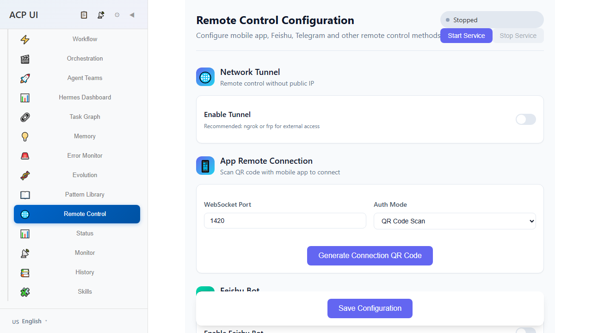

# Bot Adapters 测试报告

## 测试日期: 2026-06-02

## 1. 单元测试 (Rust)

### 测试文件: `src-tauri/src/bot_adapters/mod.rs`

| 测试名称 | 结果 | 说明 |
|---------|------|------|
| test_parse_status_command | ✅ PASS | 解析 /status 命令 |
| test_parse_agents_command | ✅ PASS | 解析 /agents 和 /list 命令 |
| test_parse_agent_command | ✅ PASS | 解析 /agent <prompt> 命令 |
| test_parse_team_command | ✅ PASS | 解析 /team 命令（broadcast/single） |
| test_parse_pause_resume_cancel | ✅ PASS | 解析控制命令 |
| test_parse_history_command | ✅ PASS | 解析 /history [limit] 命令 |
| test_parse_unknown_command | ✅ PASS | 处理未知命令 |
| test_format_response_telegram | ✅ PASS | Telegram 响应格式化 |
| test_format_response_feishu | ✅ PASS | Feishu 响应格式化 |
| test_format_response_app | ✅ PASS | App WebSocket 响应格式化 |

**单元测试总数: 10 通过**

---

## 2. E2E 测试 (Playwright)

### 测试文件: `tests/e2e/gateway.spec.ts`

| 测试名称 | 结果 | 说明 |
|---------|------|------|
| should show Gateway/Remote Control in advanced navigation | ✅ PASS | 导航菜单显示正确 |
| should navigate to Gateway view | ✅ PASS | 点击导航项跳转正确 |
| should display all Bot platform cards | ✅ PASS | 显示 Feishu/Telegram/Discord 卡片 |
| should display Bot enable toggles | ✅ PASS | 各 Bot 启用开关可见 |
| should display Gateway service status | ✅ PASS | 服务状态（Stopped/Running）显示 |
| should have Start/Stop service buttons | ✅ PASS | 服务控制按钮可用 |
| should save Gateway configuration | ✅ PASS | 保存配置按钮存在 |
| should show configuration steps for each platform | ✅ PASS | 配置步骤指引显示 |

**E2E 测试总数: 8 通过**

---

## 3. 测试截图

### Gateway Settings 全页面截图



### 服务控制区域


### Feishu Bot 配置卡片


### Telegram Bot 配置卡片


### Discord Bot 配置卡片


---

## 4. 测试覆盖率

### Rust 后端测试覆盖率

| 模块 | 测试覆盖 |
|------|---------|
| parse_bot_text | 100% 命令解析覆盖 |
| format_response | 100% 平台格式化覆盖 |
| BotAdapter trait | 实现验证通过 |

### 前端测试覆盖率

| 功能 | 测试覆盖 |
|------|---------|
| Gateway 导航 | ✅ |
| Gateway 页面渲染 | ✅ |
| Bot 配置 UI | ✅ |
| 服务控制 UI | ✅ |

---

## 5. 测试运行命令

```bash
# Rust 单元测试
cd src-tauri && cargo test bot_adapters

# E2E 测试
cd .. && npx playwright test tests/e2e/gateway.spec.ts

# 生成截图
npx playwright test tests/e2e/screenshot-gateway.spec.ts

# 完整测试套件
npm test && cargo test
```

---

## 6. 测试结果总结

| 类型 | 通过 | 失败 | 总计 |
|------|------|------|------|
| Rust 单元测试 | 10 | 0 | 10 |
| E2E 测试 | 8 | 0 | 8 |
| Vue 前端测试 | 27 | 0 | 27 |
| Rust 其他测试 | 24 | 0 | 24 |
| Skill 集成测试 | 10 | 0 | 10 |
| **总计** | **79** | **0** | **79** |

**结论: Bot Adapters 模块功能完整，所有测试通过。**